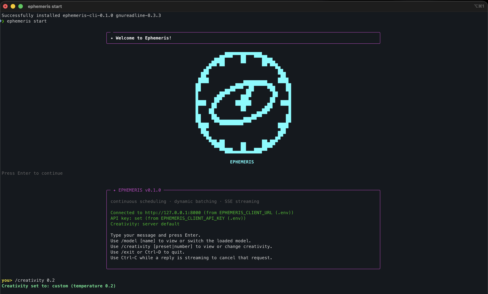
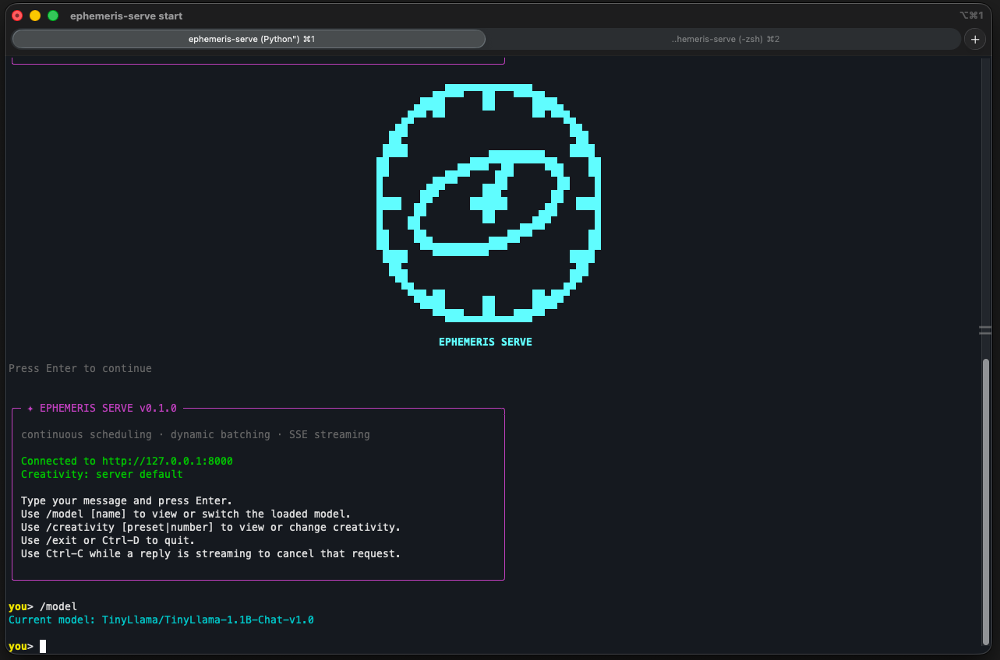
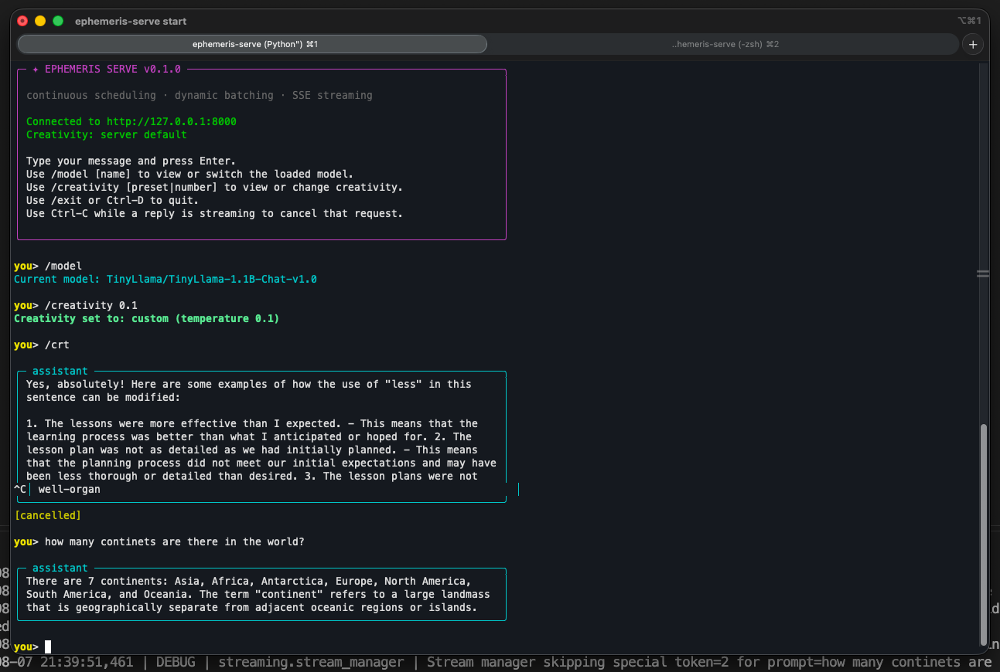

<p align="center">
  
</p>

Ephemeris Serve
=====================

Ephemeris Serve is an LLM inference server with continuous scheduling, dynamic batching, and SSE streaming for token-level outputs.

**[Project site](https://samarjitdebnath.github.io/ephemeris-serve/) · [API reference](https://samarjitdebnath.github.io/ephemeris-serve/api.html) · [Technical documentation (wiki)](https://github.com/SamarjitDebnath/ephemeris-serve/wiki)**

Key features
------------
- Continuous scheduling and request queue for efficient CPU/GPU utilization
- Dynamic batching with both streaming and non-streaming batch inference paths
- Explicit request cancellation, timeouts, and cache-state fallback handling
- SSE (Server-Sent Events) streaming of decoded tokens for low-latency client rendering
- Metrics collection for queue latency, batch size, and token throughput
- Pluggable tokenizer and model loader (Hugging Face compatible)
- Health check and lightweight FastAPI-based HTTP API

Quick start
-----------
Prerequisites: Python 3.11+, a supported GPU (optional), and access to the Hugging Face Hub if you want authenticated model downloads.

Install dependencies:

```bash
python -m venv .venv
source .venv/bin/activate
pip install -U pip
pip install -e .
```

Run the server for development:

```bash
python main.py
# or with uvicorn directly
uvicorn main:app --host 0.0.0.0 --port 8000 --reload
```

Makefile
--------
This repository includes a `Makefile` with convenient targets for setup, running, testing, and maintenance. Common commands:

```bash
# Install dependencies with development extras
make dev

# Run server (development)
make run

# Run server (production)
make run-prod

# Run unit tests
make test-unit

# Format code
make format

# Lint the codebase
make lint

# Tail application logs
make logs

# E2E: sync deps, install the CLI entry point, and start the server
make build-ephemeris
```

CLI chat client
----------------
`ephemeris-serve` (installed via the `[project.scripts]` entry point, `cli/main.py`) has two subcommands: `serve` starts the inference server itself, and `start` is a `click`-based REPL that talks to an already-running server over `/api/generate`'s SSE stream -- it does not load a model itself. Both work as plain commands once the project's virtualenv is active (`source .venv/bin/activate`, or `uv sync` followed by activating `.venv`) -- no `uv run` prefix needed.

```bash
# start the server in one terminal
ephemeris-serve serve
ephemeris-serve serve --model Qwen/Qwen2.5-0.5B   # pick a model without editing config.yaml

# chat with it from another terminal
ephemeris-serve start
ephemeris-serve start --host 127.0.0.1 --port 8000 --max-tokens 128 --creativity creative
```

Type a message and press Enter; `/exit`, `/quit`, or Ctrl-D ends the session. Each turn is an independent single-shot request -- the server doesn't retain conversation history between turns.

`--creativity` picks a friendly sampling-temperature preset (`deterministic`, `balanced`, `creative`, `high-freedom`) instead of a raw float; `--temperature <value>` is still available when you want exact control. Both the model and the creativity level can also be changed mid-session, without restarting the REPL: `/model [name]` views or hot-swaps the loaded model, and `/creativity [preset|number]` views or changes the sampling temperature for the next turn onward.
<p align="center">
  <br>
  <br>
  
</p>

Configuration
-------------
- Project settings are under the `settings` package and `config.yaml`.
- Secrets (e.g., Hugging Face token) are read from `settings/secret_settings` (see `settings/settings.py`).
- For production, disable `--reload` and tune `workers` in your process manager (or container runtime).

API
---
Base URL: `http://<host>:8000`

- GET `/` — root welcome message
- GET `/health` — returns JSON health status
- POST `/api/generate` — stream model output via SSE
- POST `/api/generate_batch` — non-streaming batched generation, returns full text output for multiple requests
- GET `/api/metrics` — exposes queue latency, batch size, and throughput metrics

Generate request schema (JSON):

```json
{
  "prompt": "Your prompt text here",
  "max_tokens": 64,
  "temperature": 0.7
}
```

Example (curl SSE stream):

```bash
curl -N -H "Accept: text/event-stream" \
  -H "Content-Type: application/json" \
  -X POST \
  -d '{"prompt":"Hello world","max_tokens":50,"temperature":0.7}' \
  http://localhost:8000/api/generate
```

Example (curl batch generation):

```bash
curl -H "Content-Type: application/json" \
  -X POST \
  -d '{"requests": [{"prompt": "Hello world", "max_tokens": 50, "temperature": 0.7}]}' \
  http://localhost:8000/api/generate_batch
```

Example (curl metrics):

```bash
curl http://localhost:8000/api/metrics
```

Notes:
- `/api/generate` enqueues an `InferenceRequest` and returns a streaming `text/event-stream` response of decoded tokens.
- `/api/generate_batch` accepts one or more batch requests and returns aggregated text output once generation completes.
- `/api/metrics` returns server metrics for queue latency, batch size, and throughput.

Development
-----------
- Run tests with `pytest`.
- Use the development extras from `pyproject.toml` for linting and formatting.

Testing
-------
Run the test suite:

```bash
pytest -q
```

Project layout
--------------
- `api/` — FastAPI routes and server factory (`api/server.py`, `api/routes.py`)
- `engine/` — model loading and generation orchestration (`model_loader.py`, `generator.py`)
- `scheduler/` — continuous scheduler and request queue
- `streaming/` — SSE stream helpers and token streaming
- `tokenizer/` — tokenizer service abstraction
- `settings/` — configuration and secrets
- `schemas/` — Pydantic request/response models
- `tests/` — unit and integration tests
- `docs/` — microsite (landing page + API reference), served directly by GitHub Pages from `main` / `docs`
- `wiki/` — source of truth for the [GitHub wiki](https://github.com/SamarjitDebnath/ephemeris-serve/wiki) (see below)

Documentation
-------------
The in-depth technical documentation lives in the [GitHub wiki](https://github.com/SamarjitDebnath/ephemeris-serve/wiki). The wiki is **generated from `wiki/` in this repository**, so it is version-controlled and reviewable in pull requests like any other file.

To change a wiki page, edit the matching file under `wiki/` and publish it:

```bash
make wiki-sync
```

Edits made directly in the GitHub wiki UI are overwritten by the next sync. The first sync requires the wiki to exist: enable **Settings → Features → Wikis**, then create any one page in the wiki UI so GitHub provisions the `.wiki.git` repository.

Contributing
------------
- Open an issue or submit a PR with tests and concise changes.
- Follow existing code style; use `black` / `isort` for formatting.

License
-------
Refer to `pyproject.toml` for package metadata and the `LICENSE` file for the applicable license terms.

Useful files
------------
- [main.py](main.py) — development entrypoint
- [api/server.py](api/server.py) — FastAPI app factory and lifespan hooks
- [api/routes.py](api/routes.py) — primary API routes (including `/api/generate`)
- [schemas/schemas.py](schemas/schemas.py) — request/response models
- [pyproject.toml](pyproject.toml) — dependencies and packaging
