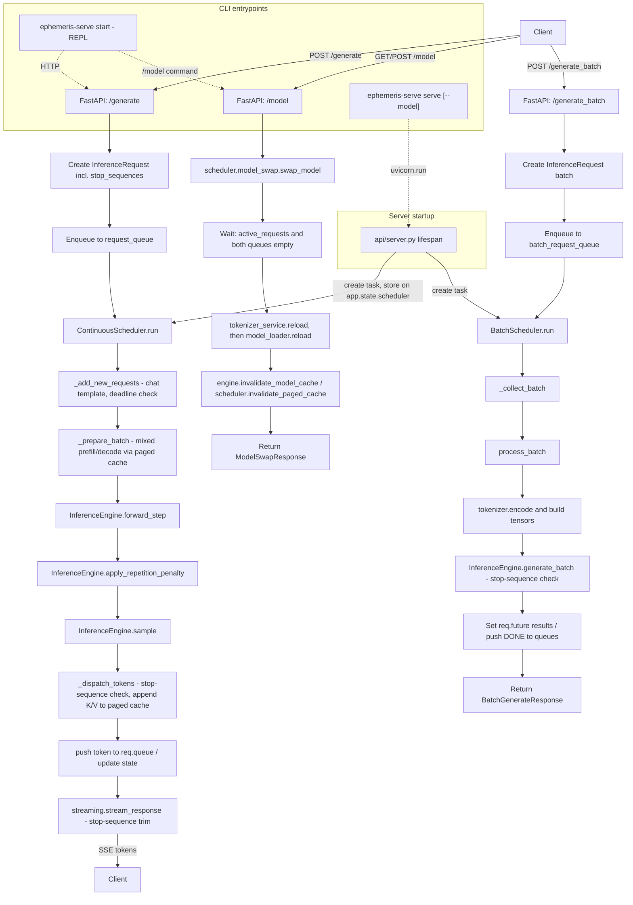

<p align="center">
  
</p>

# Ephemeris Serve - Technical Documentation

## Overview

This repository implements a lightweight FastAPI-based inference server for autoregressive language models using the Hugging Face `transformers` ecosystem.

The system is architected around a continuous token scheduler that batches prompt requests, reuses a per-request slice of a shared paged KV cache, and streams decoded text back to the client through SSE. A separate `click`-based CLI (`cli/main.py`) can both launch the server and act as a REPL chat client against it.

Key capabilities:
- HTTP endpoint `/api/generate` for streaming, prompt-based generation
- HTTP endpoint `/api/generate_batch` for non-streaming batch generation with request timeout and cancellation support
- HTTP endpoint `/api/model` (`GET`/`POST`) to inspect or hot-swap the loaded model without a process restart
- HTTP endpoint `/api/metrics` for runtime queue and batch metrics
- Server-sent events (SSE) token streaming using `EventSourceResponse`
- Automatic chat prompt formatting when tokenizer supports `apply_chat_template()`, with raw-prompt fallback for base models
- Central request queues and a continuous scheduler for asynchronous generation, using a block-based ("paged") KV cache that supports mixing prefill and decode rows in the same batched step
- Per-request `stop` sequences, checked on both the streaming and batch generation paths
- Buffered token streaming that emits only at whitespace/punctuation boundaries or after a short buffer threshold
- Pytorch model execution with configurable temperature, top-k, top-p, and repetition penalty
- Configurable model and logging settings via YAML, environment variables, and `.env`
- A CLI (`ephemeris-serve`) that can start the server (`serve`, with `--model` selection) and chat with a running one (`start`, a boxed-UI REPL with a `/model` command for runtime model switching)

---

## Architecture Flow



> The scheduler batches active requests and reuses each request's slice of a shared paged KV cache to avoid recomputing full prompts on every step -- including when a brand-new (prefill) request joins the same batched step as requests already mid-decode.

---

## Root Entry Point

### `main.py`

The launcher used during local development and by `make run`/`make run-prod`.

Implementation details:
- Imports `uvicorn` and `app` from `api.server`.
- Calls `uvicorn.run("main:app", host="0.0.0.0", port=8000, workers=1, reload=True)`.
- `workers=1` is explicitly chosen for development and to avoid model loading overhead on multiple workers.
- `reload=True` enables auto-reload on source changes and should be disabled in production.

### `ephemeris-serve serve` (`cli/main.py`)

An alternative entrypoint to `main.py`, installed via the `[project.scripts]` entry point. Runs the same `api.server:app`, but exposes `--host`, `--port`, `--workers`, `--reload`, and (unlike `main.py`) `--model` as CLI flags instead of hardcoded values. See [CLI Layer](#cli-layer) below.

---

## API Layer

### `api/server.py`

This module constructs the FastAPI application and defines application lifecycle behavior.

Imports:
- `FastAPI` and `JSONResponse` from `fastapi`
- `asynccontextmanager` from `contextlib`
- `login` from `huggingface_hub`
- `asyncio`
- `router` from `api.routes`
- `HealthResponse` from `schemas.schemas`
- `logging_settings`, `model_settings`, `scheduler_settings`, `secret_settings` from `settings.settings`
- `Utils` from `utils.utils`
- `setup_logger` from `logger`

Lifecycle logic:
- `lifespan` is an async context manager used by FastAPI for startup and shutdown.
- On startup:
  - Log `Starting up the server...`.
  - Call `Utils.configure_multiprocessing()` early, before any heavy `torch`/model imports, to avoid semaphore/`resource_tracker` warnings.
  - Import `tokenizer_service`, `model_loader`, `BatchScheduler`, `ContinuousScheduler`, and `engine` (deferred until after multiprocessing configuration, for the same reason).
  - If `secret_settings.hf_key` is defined, call `login(token=secret_settings.hf_key)` to authenticate to the Hugging Face Hub; otherwise log a warning and continue with anonymous access.
  - Call `tokenizer_service.load()` to instantiate the tokenizer.
  - Call `model_loader.load()` to instantiate the model and move it to the configured device.
  - Call `model_loader.warmup()` to run a single forward pass and initialize internal model caches.
  - Instantiate `ContinuousScheduler(engine, tokenizer_service)` and store it as `app.state.scheduler` -- this is how route handlers (e.g. `POST /api/model`) reach the live scheduler instance, since it's otherwise only closed over by the background task.
  - Start the scheduler loop in the background with `asyncio.create_task(scheduler.run())`.
  - Instantiate `BatchScheduler(engine, tokenizer_service, request_timeout=scheduler_settings.batch_request_timeout_seconds)` and start its loop the same way.
- On shutdown:
  - Cancel both scheduler tasks.
  - Await each canceled task and ignore `asyncio.CancelledError`.

App creation:
- `create_app()` builds `FastAPI(title="Ephemeris Serve", version="0.1.0", lifespan=lifespan)`.
- Defines `/` root endpoint returning a JSON welcome message.
- Defines `/health` endpoint returning a `HealthResponse` model with `status: "healthy"`.
- Includes `api.routes` under prefix `/api`.
- Exposes `app = create_app()`.

Notes:
- All request and lifecycle logs are written using the configured logger.
- Startup and shutdown are tied to FastAPI's lifespan, ensuring model and scheduler lifecycle are managed automatically.

### `api/routes.py`

This module implements the public inference endpoints.

Imports:
- `APIRouter`, `HTTPException`, `Request` from `fastapi`
- `EventSourceResponse` from `sse_starlette.sse`
- `GenerateRequest`, `BatchGenerateRequest`, `BatchGenerateResponse`, `ModelSwapRequest`, `ModelSwapResponse` from `schemas.schemas`
- `InferenceRequest` from `scheduler.request`
- `idempotency_store` from `scheduler.idempotency`
- `stream_response` from `streaming.stream_manager`
- `request_queue`, `batch_request_queue` from `scheduler.request_queue`
- `swap_lock`, `swap_model` from `scheduler.model_swap`
- `logging_settings`, `model_settings`, `scheduler_settings` from `settings.settings`
- `INTERNAL_ERROR_MESSAGE` from `utils.errors` (see [Utility Helpers](#utility-helpers))
- `metrics`, `streaming_metrics`, `summarize_batch_response_metrics` from `metrics.metrics` (see [Metrics](#metrics))
- `setup_logger` from `logger`

`cancel_futures_on_disconnect(request, futures, poll_interval)`:
- Used by `/generate_batch` (a non-streaming JSON endpoint, so there's no SSE listener already reading the disconnect signal). `/generate` instead hooks `EventSourceResponse`'s own `client_close_handler_callable` -- see below.
- Polls `request.is_disconnected()` in a loop; once the client disconnects, cancels every future in `futures` that isn't already done.

`_replay_result(result)`:
- A single-frame async generator that yields an already-completed result string -- used to replay a cached idempotent response through the same `EventSourceResponse` shape as a live stream.

`POST /generate`:
- Rejects immediately with `503` if `swap_lock.locked()` (a model hot-swap is in progress -- see `scheduler/model_swap.py`).
- Logs the prompt, `max_tokens`, `temperature`, `idempotency_key`, and `stop`.
- If `idempotency_key` is set: checks `idempotency_store`. A completed, non-failed prior result is replayed via `_replay_result`; a still-in-flight prior request returns `409`; a failed prior attempt is discarded and this request proceeds fresh.
- Constructs `InferenceRequest(req.prompt, req.max_tokens, req.temperature, req.stop)` and sets its `deadline = enqueue_time + scheduler_settings.streaming_request_timeout_seconds`.
- If `idempotency_key` is set, stores the request in `idempotency_store` before enqueueing.
- Enqueues onto `request_queue` and returns `EventSourceResponse(stream_response(inference_request), client_close_handler_callable=_cancel_on_client_disconnect)`.
- `_cancel_on_client_disconnect(message)`: cancels `inference_request.future` if not already done. Passed as `EventSourceResponse`'s own `client_close_handler_callable` rather than run via `cancel_futures_on_disconnect` as a separate polling task (unlike `/generate_batch`, below) -- `sse_starlette`'s `EventSourceResponse` is itself the sole reader of the ASGI `receive` channel for this request, and its disconnect listener has no timeout, so a second poller calling `request.is_disconnected()` in parallel always loses the race for the one-shot `http.disconnect` message. That previously left the future never cancelled, so the scheduler kept generating tokens for a client that had already gone away. Hooking `EventSourceResponse`'s own listener sidesteps the race entirely.

`POST /generate_batch`:
- Rejects immediately with `503` if `swap_lock.locked()`.
- Builds one `InferenceRequest` per item in `batch_req.requests` (each with its own `stop`), each with `deadline = enqueue_time + scheduler_settings.batch_request_timeout_seconds`.
- Enqueues every request onto `batch_request_queue`, then `asyncio.gather`s their futures under an overall `asyncio.wait_for(..., timeout=scheduler_settings.batch_generation_timeout_seconds)`, with `cancel_futures_on_disconnect` running as a background task for the duration (this endpoint isn't SSE, so there's no `EventSourceResponse` listener to hook instead -- the race described above doesn't apply here).
- On overall timeout: cancels any still-pending futures and raises `504`.
- Per-result handling: a cancelled future raises `499`; any other exception is logged in full server-side and raises `500` with `detail=INTERNAL_ERROR_MESSAGE` (never the raw exception text); a non-`str` result raises `500` with the same generic detail, as a defensive check.
- Returns a `BatchGenerateResponse` with per-batch `queue_latency_ms`/`token_throughput_per_sec` from `metrics.summarize_batch_response_metrics()`.

`GET /model`:
- Returns `ModelSwapResponse(model_name=model_settings.model_name)` -- the model currently loaded and serving.

`POST /model`:
- Returns `409` if a swap is already in progress (`swap_lock.locked()`).
- Returns `503` if `request.app.state.scheduler` isn't set yet (server still starting up).
- Calls `scheduler.model_swap.swap_model(swap_req.model_name, scheduler, drain_timeout)`, where `drain_timeout` is `swap_req.drain_timeout_seconds` or `scheduler_settings.model_swap_drain_timeout_seconds`.
- Maps `TimeoutError` (drain took too long) to `504` with `detail=str(exc)` -- this message is deliberately authored (not raw exception text), so it's safe to return as-is. Any other exception (bad repo id, OOM, ...) is logged in full via `logger.exception` and mapped to `500` with `detail=INTERNAL_ERROR_MESSAGE`, never the raw exception text.
- Returns `ModelSwapResponse(model_name=new_name)` on success.

Client-facing errors never carry raw exception text: every `500` response above, and the SSE `error` event pushed by `ContinuousScheduler._fail_active_batch()` (see [Scheduler Layer](#scheduler-layer)), use the same `utils.errors.INTERNAL_ERROR_MESSAGE` constant. The real exception is always logged server-side (`logger.exception`/`logger.warning`) at the point of failure; only deliberately-authored, already-safe messages (e.g. the `409`/`503`/`504` details above) are ever sent verbatim.

`GET /metrics`:
- Returns `{"batch": metrics.snapshot(), "streaming": streaming_metrics.snapshot()}`.

Low-level notes:
- The streaming endpoint does not block on actual model generation; it returns a stream handle immediately.
- The batch endpoint is designed for synchronous batch workflows and returns full text output once generation completes.
- `GenerateRequest`, `BatchGenerateRequest`, and `ModelSwapRequest` validation occur before any request objects are created.
- `/generate` and `/generate_batch` only *check* `swap_lock.locked()` (a fast, non-blocking read); they never wait on the lock, so a swap in progress fails fast rather than queuing behind it.

---

## Model and Tokenizer

### `engine/model_loader.py`

Loads, warms up, and (at runtime) hot-swaps the Hugging Face language model.

Imports:
- `gc`
- `torch`
- `AutoModelForCausalLM` from `transformers`
- `model_settings` from `settings.settings`
- `tokenizer_service` from `tokenizer.tokenizer_service`
- `empty_device_cache` from `utils.device_cache` (see [Utility Helpers](#utility-helpers))

Class `ModelLoader`:
- `self.model` is initialized as `None`.
- `load()`: if `self.model is None`, builds and assigns it via `self._build_model(model_settings.model_name)`.
- `_build_model(model_name)`: the shared build routine --
  - Selects dtype based on device: `torch.float16` for `mps`, `torch.float32` otherwise.
  - Calls `AutoModelForCausalLM.from_pretrained(model_name, dtype=dtype)`, moves it to `model_settings.device`, calls `.eval()`.
  - Logs the outcome (device, dtype, model type, vocab size) and returns the model object -- it does **not** touch `self.model`.
  - Used for both the initial `load()` and runtime `reload()`.
- `reload(model_name)`: runtime model hot-swap, used by `scheduler/model_swap.py` once it has confirmed no requests are in flight --
  - Calls `_build_model(model_name)` fully *before* touching `self.model`. If it raises (bad repo id, network error, OOM, ...), the previously-loaded model is left running untouched.
  - On success: swaps `self.model` to the new model, updates `model_settings.model_name`, then drops the old model reference, runs `gc.collect()`, and calls `utils.device_cache.empty_device_cache(model_settings.device)` to release its memory. This was previously a private module-level `_empty_device_cache()` helper duplicated in a couple of places; it's now the single shared implementation in `utils/device_cache.py`, also used by `scheduler/continuous_scheduler.py`, `scheduler/batch_scheduler.py`, and `scheduler/model_swap.py`.
- `_get_model()`: lazily calls `load()` if needed and returns the model instance.
- `warmup()`: obtains the model instance, encodes `"Warmup request"` via `tokenizer_service.encode(..., return_tensors=True)`, moves `input_ids` to the model device, and runs one `torch.no_grad()` forward pass (`torch.argmax` on the resulting logits) to exercise the forward path once before serving real traffic.

Global singleton:
- `model_loader = ModelLoader()`

### `tokenizer/tokenizer_service.py`

Manages tokenizer initialization, encoding, decoding, and (at runtime) hot-swapping.

Imports:
- `AutoTokenizer` from `transformers`
- `model_settings` from `settings.settings`

Class `TokenizerService`:
- `self.tokenizer` is initialized as `None`.
- `load()`: if `self.tokenizer is None`, builds and assigns it via `self._build_tokenizer(model_settings.model_name)`.
- `_build_tokenizer(model_name)`: the shared build routine -- instantiates `AutoTokenizer.from_pretrained(model_name)`, sets `pad_token = eos_token` if missing, sets `padding_side = "left"`, and returns the tokenizer object without touching `self.tokenizer`.
- `reload(model_name)`: mirrors `ModelLoader.reload` -- builds the new tokenizer fully via `_build_tokenizer` before publishing it to `self.tokenizer`, so a failure leaves the previous tokenizer active.

Encoding:
- `encode(text, return_tensors=False)` loads the tokenizer if needed.
- If `return_tensors=True`, returns the raw transformer output dictionary containing `input_ids` and `attention_mask`.
- Otherwise, returns a plain Python list of token IDs from the first batch element.
- Uses truncation and `max_length=model_settings.max_length` to constrain sequence length.

Decoding:
- `decode(tokens)` loads the tokenizer if needed and returns decoded text with `skip_special_tokens=True`.

Global singleton:
- `tokenizer_service = TokenizerService()`

Low-level data shapes:
- `input_ids` returned by `tokenizer(..., return_tensors='pt')` is a tensor of shape `(1, seq_len)`.
- `attention_mask` is a tensor of shape `(1, seq_len)`.

---

## Scheduler Layer

The scheduler is the core of the system and manages request multiplexing, batching, and incremental generation.

### `scheduler/request_queue.py`

A minimal wrapper around `asyncio.Queue`.

Class `RequestQueue`:
- `self.queue = asyncio.Queue()`.
- `async def put(self, request)`.
- `async def get(self)`.
- `def empty(self) -> bool`: returns `self.queue.empty()` -- used by `scheduler/model_swap.py` to confirm no request is sitting in the queue, unpicked-up, before a swap proceeds.

Global singletons:
- `request_queue = RequestQueue()`, `batch_request_queue = RequestQueue()`.

These queues are the handoff point between the HTTP endpoints and the scheduler loops.

### `scheduler/idempotency.py`

An in-process, TTL-bounded store mapping a client-supplied `idempotency_key` to the `InferenceRequest` it was assigned. Used by `POST /api/generate` to deduplicate retried requests.

Class `IdempotencyStore`:
- `get(key)`: lazily purges expired entries, returns the live `InferenceRequest` for `key` if present, else `None`.
- `put(key, request)`: stores `(time.monotonic() + ttl_seconds, request)`.
- `discard(key)`: removes an entry.
- TTL defaults to `scheduler_settings.idempotency_key_ttl_seconds`.

Purging is lazy (on `get`/`put`), not a background task -- there is no persistence layer elsewhere in this repo, so the store is scoped to a single process's lifetime.

Global singleton:
- `idempotency_store = IdempotencyStore()`.

### `scheduler/request.py`

Defines the in-memory request state used by the scheduler and streaming layers.

`InferenceRequest.__init__(prompt, max_tokens, temperature, stop_sequences=None)`:
- `prompt: str`
- `max_tokens: int` -- falls back to `model_settings.max_length` if `None`
- `temperature: float` -- falls back to `model_settings.temperature` if `None`
- `stop_sequences: list[str]` -- `list(stop_sequences)` if given, else `[]`
- `future: asyncio.Future[str]` -- created from the currently running event loop (or a newly created one if none is running), used for external completion notification
- `queue: asyncio.Queue[int | str | tuple]` -- streams token IDs, the final `"[DONE]"` sentinel, and the `("[ERROR]", message)` sentinel
- `enqueue_time: float`, `deadline: float | None` -- timeout enforcement on both the streaming and batch paths
- `queue_latency_ms: float | None` -- set once the request is admitted into a scheduler
- `input_ids: Optional[torch.Tensor]` -- set when the request enters the scheduler; grows by one column per generated token
- `generated_tokens: list[int]` -- tokens produced so far
- `finished: bool`
- `block_table: BlockTable` (from `cache.paged_kv_cache`) -- this request's slice of the shared `PagedKVCache`; starts empty, which is the scheduler's "no cached prefill yet" signal

Note: there is no `attention_mask` or `past`/`DynamicCache` field on `InferenceRequest` -- the attention mask is rebuilt each step from `block_table`/`_prepare_batch`, and the KV cache lives in the scheduler's shared `PagedKVCache`, addressed per-request via `block_table`, not stored per-request as a `DynamicCache`.

There is no `ActiveRequest` wrapper type. `InferenceEngine.generate_batch()` operates directly on `InferenceRequest` objects (paired with their original index) via a structural `GenerationRequest` protocol -- see `engine/generator.py` and the Appendix.

### `scheduler/continuous_scheduler.py`

This module is responsible for continuous request consumption, dynamic batching (including mixing prefill and decode rows in the same step), and incremental token generation, backed by a block-based ("paged") KV cache.

Imports:
- `asyncio`, `time`, `torch`, `dataclass`, `List`, `Optional`
- `DynamicCache` from `transformers`
- `model_settings`, `logging_settings`, `cache_settings` from `settings.settings`
- `tokenizer_service` from `tokenizer.tokenizer_service`
- `request_queue` from `scheduler.request_queue`
- `InferenceRequest` from `scheduler.request`
- `find_stop_index` from `utils.stop_sequences`
- `empty_device_cache`, `maybe_empty_device_cache` from `utils.device_cache` (see [Utility Helpers](#utility-helpers))
- `INTERNAL_ERROR_MESSAGE` from `utils.errors`
- `streaming_metrics` from `metrics.metrics` (see [Metrics](#metrics))
- `PagedKVCache` from `cache.paged_kv_cache` (see [Cache Layer](#cache-layer))
- `setup_logger` from `logger`

`_BatchInputs` dataclass -- one step's batched forward-pass inputs, built by `_prepare_batch()`:
- `input_ids`, `attention_mask`, `position_ids`, `logit_gather_indices`: `torch.Tensor`
- `past_key_values: Optional[DynamicCache]`
- `past_width: int` -- the shared past-region width fed into this step (same for every row)
- `new_lengths: List[int]` -- per-row count of real new tokens contributed this step (a row's whole prompt on its first step, or `1` while mid-decode)

`ContinuousScheduler.__init__(engine, tokenizer, max_batch_size=8, timeout=0.01)`:
- `engine`: `InferenceEngine` instance.
- `tokenizer`: `TokenizerService` instance.
- `max_batch_size`: default 8.
- `timeout`: default 0.01 seconds (queue-poll interval used by `_add_new_requests`; distinct from a request's `deadline`).
- `active_requests: list[InferenceRequest]` starts empty.
- `_paged_cache: Optional[PagedKVCache]` starts `None` -- constructed lazily.

#### `paged_cache` property

- Block-based KV cache storage shared by every active request. Built on first access (not in `__init__`, so it doesn't force the model to load before it's otherwise needed).
- Derives its shape from `self.engine.model.config`: `num_kv_heads` (`num_key_value_heads`, falling back to `num_attention_heads`), `head_dim` (`head_dim`, falling back to `hidden_size // num_attention_heads`), `num_layers` (`num_hidden_layers`), `block_size` from `cache_settings.kv_block_size`, and the engine's `dtype`/`device`.

#### `invalidate_paged_cache()`

- Sets `self._paged_cache = None`, forcing a rebuild (against whatever model is now loaded) on next access. Used after a runtime model swap (`scheduler/model_swap.py`) -- the old cache's tensor shapes are tied to the previous model's architecture. Must only be called once the caller has confirmed `active_requests` is empty, since an active request's `block_table` still points into the old cache.

#### `_pad_batch(tensors, padding_value)`

- Right-pads each 2D tensor to the batch's max width along dim 1 and concatenates along dim 0.
- Used for the "new tokens this step" region: real content starts at column 0 for every row, so once concatenated after that row's real past it stays one contiguous real range.

#### `_add_new_requests()`

- While `len(self.active_requests) < self.max_batch_size`: calls `await asyncio.wait_for(request_queue.get(), timeout=self.timeout)`; on timeout, returns.
- For each dequeued `InferenceRequest`:
  - Applies a chat prompt template if the tokenizer exposes `apply_chat_template()` (formats the prompt as a single `user` message, `add_generation_prompt=True`), otherwise uses the raw prompt. A template failure is caught and logged, falling back to the raw prompt.
  - If `req.deadline` has already passed (e.g. it sat behind a long queue backlog), the request is failed immediately via `_fail_request_timeout()` and never scheduled -- no forward-pass compute is spent on an already-dead request.
  - Encodes the resulting text via `self.tokenizer.tokenizer(..., return_tensors='pt')` and moves `input_ids` to `self.engine.device`.
  - `req.block_table` starts empty (from `InferenceRequest.__init__`) -- that's the "no KV cache yet" signal for the first step.
  - Records `req.queue_latency_ms = time.monotonic() - req.enqueue_time` and calls `streaming_metrics.record_queue_latency(...)` exactly once per admitted request.
  - Appends the request to `self.active_requests`.

#### `_prepare_batch() -> Optional[_BatchInputs]`

Builds one batched forward-pass input, **mixing prefill and decode rows in the same step**: a request with no cached past yet (`block_table.length == 0`) contributes its whole prompt as new input; a request already mid-decode contributes exactly its one most-recently-generated token (`input_ids[:, -1:]`). Both kinds of rows are batched together, so one request joining never forces every other active request to redo a full-sequence recompute. Returns `None` if there are no active requests.

Steps:
1. For each active request, if `block_table.length > 0` but `paged_cache.is_valid(block_table)` is `False`, logs a warning and frees the table -- the next step will fall back to a fresh prefill for that request.
2. Builds `new_token_tensors` (the per-row "new tokens this step", as above) and `new_lengths = [t.shape[1] for t in new_token_tensors]`; `max_new_len = max(new_lengths)`.
3. Calls `self.paged_cache.gather_dense([req.block_table for req in active_requests])` to get `(keys_per_layer, values_per_layer, past_lengths)` -- a left-padded, batched dense view of each row's real cached history. `past_width = max(past_lengths)`.
4. `input_ids`: the new-tokens region, right-padded to `max_new_len` via `_pad_batch` (padding value = the tokenizer's `pad_token_id`).
5. `attention_mask`: per row, `[past region, left-padded to past_width]` concatenated with `[new-tokens region, right-padded to max_new_len]` -- built directly from `past_len`/`new_len`, not assumed.
6. `position_ids`: derived from the attention mask itself (`cumsum(attention_mask, dim=1)`, sliced to the new-tokens region, `-1`, clamped to `>= 0`) -- correct regardless of which side padding sits on.
7. `logit_gather_indices`: per row, `new_len - 1` -- the column (within the logits tensor, which spans only the new-tokens region) holding the real last-new-token prediction, since the new-tokens region is right-padded and a shorter row's real content doesn't sit at the tensor's absolute end.
8. `past_key_values`: `None` if `past_width == 0`, else a `DynamicCache` built from the batched per-layer `(keys, values)` gathered in step 3.

#### `_dispatch_tokens(next_tokens, new_past, past_width, new_lengths)`

Streams sampled tokens back to clients and updates per-request state. `next_tokens` has shape `(batch, 1)`.

Per request (index `idx`):
1. If `req.queue` is set, `put_nowait(token_id)` immediately (before the stop-sequence check below -- see `streaming/stream_manager.py` for how the client side still avoids ever seeing the stop text).
2. Appends `token_id` to `req.generated_tokens`.
3. **Stop-sequence check**: if `req.stop_sequences` is non-empty, decodes the *full* `req.generated_tokens` (a stop sequence can span multiple tokens and needn't align with token boundaries) and calls `find_stop_index(decoded, req.stop_sequences)`. If a match is found, `stop_text = decoded[:stop_idx]` (the text to actually return, with the stop sequence and anything after it trimmed).
4. Appends the new token to `req.input_ids`.
5. Extracts this step's newly computed K/V for row `idx` via `_extract_new_kv()` and either frees the request's `block_table` (if extraction failed) or appends the new K/V into the shared `paged_cache`.
6. Finishes the request (`_finish_request(req, final_text=stop_text)`) if `stop_text is not None`, or `token_id == self.engine.eos_token_id`, or `len(req.generated_tokens) >= req.max_tokens`.

Finished requests are removed from `self.active_requests` at the end.

#### `_extract_new_kv(new_past, idx, start_col, length, prompt)`

Pulls request `idx`'s newly computed `(key, value)` tensors out of `new_past`, using the exact real-content range `[start_col : start_col + length]` for that row (not just "the last N columns" -- with a mixed batch, a shorter-than-max row's real new tokens sit before some trailing padding). Returns `None` (logging a warning) if `new_past` is missing or structurally invalid, in which case the caller drops the request's cached state and lets it recompute from scratch on the next step.

#### `_finish_request(req, final_text=None)`

Shared finalization helper (used by `_dispatch_tokens`'s natural-completion branch and by `_evict_expired_requests()`):
- Sets `req.finished = True`.
- If `req.future` is not done, resolves it with `final_text` if given, else `tokenizer_service.decode(req.generated_tokens)`. `final_text` is what a stop-sequence match passes in, so the matched text (and anything after it) never reaches the caller.
- Enqueues `"[DONE]"` into `req.queue` if present.
- Frees the request's paged-cache blocks via `_free_block_table()`.

#### `_fail_request_timeout(req)`

Fails a request that timed out before generating any tokens: sets `asyncio.TimeoutError` on `req.future` if not already done, enqueues `("[ERROR]", "generation timed out")`, and frees its block table.

#### `_fail_active_batch(exc)`

Called when a generation step fails twice in a row (see `_step()`). Sets `exc` -- which may carry internal detail (stack-trace-flavored text, memory sizes, ...) -- as the exception on every active request's future, for internal bookkeeping only; pushes an `("[ERROR]", INTERNAL_ERROR_MESSAGE)` sentinel to each request's queue instead of `str(exc)`, so the client-facing SSE message is always the generic, safe constant from `utils.errors` (the real exception is already logged in full by the caller, `_step()`, before this runs). Frees every block table and clears `self.active_requests`. A batched forward pass fails or succeeds as a unit, so failure applies to the whole active batch, not individual requests.

#### `_evict_cancelled_requests()`

Filters `self.active_requests` to drop any request whose `future.cancelled()` is `True` (set by `api/routes.py`'s disconnect-polling task), freeing its block table. No finalization is attempted -- the future is already terminal, and there's no client left to read `req.queue`.

#### `_free_block_table(req)`

Returns a request's paged KV blocks to the pool, if it has any (`block_table.block_ids` non-empty). Guarded so this never forces the (lazily-constructed) paged cache -- and therefore the model -- to load just to free a table that was never populated.

#### `_evict_expired_requests()`

Evicts any request whose `deadline` has passed: if it already generated at least one token, finished with that partial output via `_finish_request()`; otherwise failed via `_fail_request_timeout()`.

#### `_forward_and_sample(batch_inputs)`

Runs `engine.forward_step(input_ids, attention_mask, past_key_values, position_ids=..., logit_gather_indices=...)`, `engine.apply_repetition_penalty()`, and per-request `engine.sample()` (using each request's own `temperature`, and the global `model_settings.top_k`/`top_p`), returning `(next_tokens, new_past)`. Extracted so `_step()` can retry the same call once on failure without duplicating it.

#### `_step()`

Coordinates a single scheduler iteration:
1. `_evict_cancelled_requests()` and `_evict_expired_requests()` run first, before any tensors are built.
2. If `self.active_requests` is empty after eviction, return.
3. `batch_inputs = self._prepare_batch()`; if `None`, return.
4. `self._forward_and_sample(batch_inputs)`. On failure, log a warning, call `empty_device_cache(self.engine.device)`, then retry once -- the retry is only likely to help for an OOM-shaped failure, and retrying against the exact same (still-exhausted) device memory state that just failed would almost certainly fail again. If the retry also fails, log the exception in full, `self._fail_active_batch(exc)`, and return without dispatching.
5. `await self._dispatch_tokens(next_tokens, new_past, batch_inputs.past_width, batch_inputs.new_lengths)`.
6. Device memory is released proactively rather than only on failure/idle: if `self.active_requests` is now empty, calls `empty_device_cache(self.engine.device)` unconditionally; otherwise calls `maybe_empty_device_cache(self.engine.device)`, which only clears once usage crosses 70% of the device's memory budget (a cheap metadata query every step via `utils.device_cache.device_memory_pressure()`, not a device sync). This closes the gap where a single long-running request that never hits a failure or an idle gap could otherwise accumulate cached-but-unused memory all the way to the device's actual ceiling (observed as `MPS backend out of memory`).
7. Records `streaming_metrics.record_batch_size(active_count)` and `streaming_metrics.record_token_throughput(active_count, elapsed)` -- one token per active request per step.

#### `run()`

Main scheduler loop: forever, `await self._add_new_requests()`; if `active_requests` is empty, sleep `0.01`s and continue; otherwise `await self._step()`. On any exception, logs the stack trace and sleeps 1 second before retrying. Started once during FastAPI startup (`api/server.py`) and canceled cleanly on shutdown.

### `scheduler/model_swap.py`

Hot-swaps the model an already-running server serves, without a process restart. Used by `POST /api/model` (`api/routes.py`) and the CLI's `/model` REPL command (`cli/main.py`).

Imports:
- `asyncio`, `gc`, `time`
- `engine` from `engine.generator`
- `model_loader` from `engine.model_loader`
- `tokenizer_service` from `tokenizer.tokenizer_service`
- `request_queue`, `batch_request_queue` from `scheduler.request_queue`
- `model_settings`, `logging_settings` from `settings.settings`
- `empty_device_cache` from `utils.device_cache`
- `setup_logger` from `logger`

Module-level `swap_lock = asyncio.Lock()`: held for the duration of a swap. Route handlers that accept new requests check `swap_lock.locked()` (a fast, non-blocking read -- not full acquisition, since a swap can take a while) and reject with `503` rather than letting requests pile up against a model that's about to disappear.

`swap_model(new_model_name, continuous_scheduler, drain_timeout) -> str`:
1. Acquires `swap_lock`.
2. **Drain**: loops (`asyncio.sleep(0.05)` between checks) while `continuous_scheduler.active_requests` is non-empty, or `request_queue`/`batch_request_queue` isn't empty. Raises `TimeoutError` if this doesn't resolve within `drain_timeout` seconds.
3. **Swap**: reloads the tokenizer first (`tokenizer_service.reload(new_model_name)`), then the model (`model_loader.reload(new_model_name)`). If either raises, the tokenizer is explicitly rolled back to the *previous* model name (`tokenizer_service.reload(previous_model_name)`) before re-raising -- this keeps the tokenizer paired with whichever model actually ended up loaded, since `model_loader.reload` itself already leaves the old model in place on failure.
4. **Invalidate caches**: on success, calls `engine.invalidate_model_cache()` and `continuous_scheduler.invalidate_paged_cache()` so both rebuild against the new model's architecture on next use.
5. **Reclaim old paged-cache memory**: calls `gc.collect()` then `empty_device_cache(model_settings.device)`. `model_loader.reload()` already ran its own `gc.collect()`/cache-empty for the old *model*, but at that point the old *paged cache*'s block pool (dropped in step 4, just above) was still referenced by `continuous_scheduler` -- so that memory wasn't actually reclaimed until this second, later clear.
6. Returns `new_model_name`.

Because the drain step blocks on real in-flight work and the reload step performs a real (potentially slow, network-bound) model/tokenizer load, this is a genuinely slow operation by design -- callers (the API route, the CLI) are expected to use a generous timeout.

### `scheduler/batch_scheduler.py`

This module implements the non-streaming batch endpoint's background processing loop and metrics collection.

Imports:
- `asyncio`, `time`, `List`
- `InferenceRequest` from `scheduler.request`
- `batch_request_queue` from `scheduler.request_queue`
- `logging_settings`, `model_settings` from `settings.settings`
- `tokenizer_service` from `tokenizer.tokenizer_service`
- `empty_device_cache` from `utils.device_cache`
- `metrics` from `metrics.metrics` (see [Metrics](#metrics))

`BatchScheduler.__init__(engine, tokenizer, max_batch_size=8, queue_timeout=0.02, request_timeout=20.0)`.

`_collect_batch()`:
- Blocks on the first item via `await batch_request_queue.get()`, records its queue latency, then opportunistically drains up to `max_batch_size - 1` more items within the remaining `queue_timeout` window.

`process_batch(batch)`:
- Filters out requests that are already done/cancelled, or whose `deadline` has already passed (failed with `asyncio.TimeoutError` if so).
- Applies the chat template to each remaining prompt (same `apply_chat_template()` pattern as the continuous scheduler), falling back to raw prompts on failure.
- Tokenizes the batch with padding/truncation to `model_settings.max_length`.
- Calls `await self.engine.generate_batch(input_ids, attention_mask, valid_requests)`.
- Resolves each request's `future` with its output string (or an exception, if `generate_batch` itself raised).
- Records batch size and token throughput after `generate_batch()` returns.

Timeout configuration:
- `self.request_timeout` (constructor param, default from `scheduler_settings.batch_request_timeout_seconds`) is passed in explicitly by `api/server.py` at startup.
- `api/routes.py`'s `POST /generate_batch` sets each request's `deadline = enqueue_time + scheduler_settings.batch_request_timeout_seconds` -- the same settings value, so the constructor parameter and the enforced deadline don't drift independently.

`run()`: forever, collects and processes batches; sleeps briefly when the queue is empty; calls `empty_device_cache(self.engine.device)` once each batch is fully processed (PyTorch's allocator otherwise holds cached-but-unused memory rather than returning it to the system, which can accumulate across many batches on a long-running process); re-raises `asyncio.CancelledError` (logging first) rather than swallowing it, so the task actually stops on shutdown; on any other unexpected exception, fails every request in the in-flight batch and sleeps before retrying.

---

## Cache Layer

### `cache/paged_kv_cache.py`

Block-based KV cache storage shared by every request active in the `ContinuousScheduler` (see [Scheduler Layer](#scheduler-layer)). Pure PyTorch indexing -- no fused kernel, so it works identically on MPS/CPU/CUDA. This is a storage/allocation optimization only: it replaces the realloc-and-copy of a monolithically growing per-request tensor with writes into pre-allocated fixed-size blocks. Every step still materializes a dense `(batch, heads, seq, head_dim)` tensor via `gather_dense()` for the model's forward pass -- there is no fused kernel available on MPS to read scattered blocks directly.

`BlockTable` (`@dataclass`) -- one request's own view into the pool:
- `block_ids: list[int]` -- which blocks in the pool belong to this request.
- `length: int` -- real (unpadded) token count stored so far.
- Freed and reset to empty (`block_ids = []`, `length = 0`) by `PagedKVCache.free()`.

`PagedKVCache.__init__(num_layers, num_kv_heads, head_dim, block_size=16, dtype=torch.float32, device="cpu", initial_capacity_blocks=64)`:
- Allocates `key_pool`/`value_pool`: one `(capacity_blocks, num_kv_heads, block_size, head_dim)` tensor per layer, plus `free_blocks: list[int]` tracking unused block indices.
- Shape parameters mirror the loaded model's config -- see `ContinuousScheduler.paged_cache`'s derivation of `num_kv_heads`/`head_dim`/`num_layers`.

`_grow_pool(new_blocks)`:
- Allocates `new_blocks` more per-layer key/value tensors and `torch.cat`s them onto the existing pool; extends `free_blocks` with the new indices. Called by `__init__` and by `_ensure_free`.

`_ensure_free(n_blocks)`:
- If fewer than `n_blocks` are currently free, grows the pool by `max(self.capacity, n_blocks - len(free_blocks))` -- i.e. at least a full doubling, or exactly what's needed if that's larger -- so growth is amortized rather than happening one block at a time.

`allocate(table, n_tokens)`:
- Ensures `table` has enough blocks for `n_tokens` more real tokens (ceil-division block math), pulling from `free_blocks` (growing the pool first via `_ensure_free` if needed).

`append(table, keys_per_layer, values_per_layer)`:
- Appends one step's newly computed K/V for every layer into `table`'s blocks in one call. `keys_per_layer[l]`/`values_per_layer[l]` must have shape `(num_kv_heads, n_new, head_dim)`. Allocates blocks as needed via `allocate()`, then writes token-by-token across block boundaries (a request's new tokens can straddle the end of one block and the start of the next).

`gather_dense(tables) -> (keys_per_layer, values_per_layer, real_lengths)`:
- Materializes a left-padded, batched dense view for the model's forward pass: each `keys_per_layer[l]`/`values_per_layer[l]` has shape `(batch, num_kv_heads, max_len, head_dim)`, left-padded per row to the batch's longest real length (`max_len = max(real_lengths)`). `real_lengths[i]` is request `i`'s true (unpadded) token count -- the metadata the scheduler's prefill/decode mixing needs to build correct attention masks and position ids.
- Per-row gathering (`_gather_row`) walks a table's `block_ids`, concatenating full blocks plus a partial final block for the remainder.

`free(table)`:
- Releases `table`'s blocks back to `free_blocks` and resets it to empty.

`is_valid(table) -> bool`:
- Structural self-check (mirrors the defensive pattern `transformers.DynamicCache` uses internally): every block id in `table.block_ids` must be in-range and not already in `free_blocks`, and `table.length` must be consistent with the number of blocks held (`(n_blocks - 1) * block_size < length <= n_blocks * block_size`). Used by `ContinuousScheduler._prepare_batch()` to detect a corrupted/stale table and fall back to a fresh prefill for that request rather than feeding the model garbage.

---

## Inference Engine

### `engine/generator.py`

This module encapsulates model inference and token-selection logic.

Imports:
- `asyncio`, `Protocol`, `Sequence`
- `torch`
- `model_loader` from `engine.model_loader`
- `tokenizer_service` from `tokenizer.tokenizer_service`
- `find_stop_index` from `utils.stop_sequences`
- `model_settings`, `logging_settings` from `settings.settings`
- `setup_logger` from `logger`

`GenerationRequest` (`typing.Protocol`): the structural interface `generate_batch()` depends on, decoupling the engine from the scheduler package (any object with this shape, e.g. `scheduler.request.InferenceRequest`, can be batched without the engine importing scheduler-owned types). Fields: `future`, `queue`, `temperature`, `max_tokens`, `generated_tokens`, `finished`, `stop_sequences`.

`InferenceEngine.__init__()`:
- `self.device = model_settings.device`.
- `self._model = None` -- deferred; actual retrieval happens lazily via the `model` property, to avoid initializing `torch`/model state at import time (prevents semaphore leaks and is safe with multi-worker servers).

`model` property:
- If `self._model is None`, sets it via `model_loader._get_model()`. Returns `self._model`.

`invalidate_model_cache()`:
- Sets `self._model = None`, so the next `.model` access re-fetches from `model_loader`. Used after `model_loader.reload()` swaps the underlying weights out from under an already-running server (see `scheduler/model_swap.py`).

#### `sample(logits, temperature, top_k=0, top_p=1.0)`

- If `temperature <= 0`, greedy: `torch.argmax(logits, dim=-1)`, shape `(batch, 1)`.
- Otherwise: scales logits by `1/temperature`; applies top-k filtering (threshold via `torch.topk`); applies top-p (nucleus) filtering (cumulative softmax mass, `scatter_`-masked); samples with `torch.multinomial`.

#### `forward_step(input_ids, attention_mask, past_key_values=None, position_ids=None, logit_gather_indices=None)`

- Raises `RuntimeError` if `self.model` is `None`.
- Calls `self.model(input_ids=input_ids, attention_mask=attention_mask, past_key_values=past_key_values, position_ids=position_ids, use_cache=True)`.
- `position_ids`: optional explicit per-token positions, needed when the batch mixes rows with different real past lengths and/or padding (prefill/decode mixing) -- the model's implicit default position handling assumes a uniform past length across the batch, which isn't true in that case. `None` preserves the implicit behavior for pure-decode/pure-prefill batches.
- `logit_gather_indices`: optional per-row column index selecting which position's logits are the real next-token prediction for that row -- needed when a mixed batch's new-tokens region is right-padded, so the real prediction isn't always at column `-1`. If given, gathers `logits[batch_indices, logit_gather_indices, :]`; otherwise falls back to the unconditional `logits[:, -1, :]`.
- Returns `(logits.clone(), outputs.past_key_values)`, logits normalized to shape `(batch, vocab_size)`.

#### `apply_repetition_penalty(logits, input_ids, penalty=None)`

- Defaults `penalty` to `model_settings.repetition_penalty`; no-op if `penalty == 1.0`.
- For each batch row, finds unique tokens already present in `input_ids[i]` and penalizes their logits (multiply if negative, divide if positive) by `penalty`. Mutates `logits` in place and returns it.

#### `eos_token_id` property

Returns `self.model.config.eos_token_id`; raises `RuntimeError` if the model isn't loaded.

#### `generate(input_ids, max_tokens=-1, temperature=-1.0)`

A simple sequential (no KV-cache-across-requests, no eviction/insertion) generation path, used only for rapid prototyping/testing -- **not** used by the continuous scheduler, which uses `forward_step`/`sample`/`apply_repetition_penalty` directly for its paged-cache-aware loop.

#### `generate_batch(input_ids, attention_mask, requests: Sequence[GenerationRequest])`

The engine entry point used by `BatchScheduler`. Tracks active requests as `(original_index, request)` tuples -- `list(enumerate(requests))` -- rather than a wrapper object, so there's no separate state to keep in sync with the underlying request. Runs a `torch.no_grad()` loop while active requests remain:
1. Filters out requests whose `future.cancelled()` is `True`.
2. Forward pass: full batch if `past_key_values is None`, else `next_tokens` with the cached `past_key_values`.
3. Vectorized repetition penalty across the batch.
4. Samples a token per active request, using that request's own `temperature` and the global `model_settings.top_k`/`top_p`.
5. Per request: appends the token to `r.generated_tokens`, streams it to `r.queue` if present, then checks `r.stop_sequences` the same way the streaming path does -- decodes the full `generated_tokens`, calls `find_stop_index()`, and if matched, sets `stop_text` to the pre-match text. A request finishes (removed from the active batch, `outputs[original_idx]` set) when `stop_text is not None`, or EOS is reached, or `max_tokens` is hit; the output is `stop_text` if a stop matched, else the full decode.
6. Appends new tokens to `input_ids`/`attention_mask`; compacts the active batch (and `past_key_values` via `batch_select_indices`) whenever any request finished this step.

After the loop, any request without a set output (should not normally happen) is filled in via a final decode, and every request with a live `queue` receives the `"[DONE]"` sentinel.

Global singleton:
- `engine = InferenceEngine()`

---

## Streaming

### `streaming/stream_manager.py`

Converts raw token IDs from a request's queue into decoded SSE stream payloads, buffering to avoid noisy subword fragments and independently enforcing stop sequences so they never reach the client.

Imports:
- `asyncio`, `AsyncGenerator`, `Union`
- `InferenceRequest` from `scheduler.request`
- `tokenizer_service` from `tokenizer.tokenizer_service`
- `find_stop_index` from `utils.stop_sequences`
- `logging_settings` from `settings.settings`
- `setup_logger` from `logger`

`stream_response(req: InferenceRequest) -> AsyncGenerator[str | dict, None]`:
- Loops reading `req.queue` until the sentinel `"[DONE]"`.
- A `("[ERROR]", message)` tuple sentinel (pushed when a request is evicted for timing out or failing server-side) yields a single `{"event": "error", "data": message}` frame and ends the stream instead of following the `"[DONE]"` path.
- Lazily loads the tokenizer if needed; skips special token IDs (via `tokenizer_service.tokenizer.all_special_ids`).
- Accumulates every non-special token ID into a running `tokens` list and re-decodes the *entire* sequence each time (`tokenizer_service.decode(tokens)`) -- this, not per-token decoding, is what correctly handles multi-byte characters split across token boundaries. Trailing Unicode replacement characters (`�`, an incomplete UTF-8 sequence) are stripped from the decoded text before anything else happens.
- **Stop-sequence check**, run against the full decoded text before any buffering decision: if `req.stop_sequences` is non-empty and `find_stop_index()` finds a match, yields only the not-yet-emitted text up to the match (`clean_text[len(yielded_text):stop_idx]`, if non-empty) and returns -- ending the stream without ever yielding the stop sequence itself or anything after it, even if it spans the last few tokens the scheduler already pushed onto the queue before it (itself) noticed the same match and stopped generating.
- If no stop match: computes `delta = clean_text[len(yielded_text):]` and only actually yields it (`should_emit`) once the delta ends in whitespace, ends in `.,;:!?`, or has reached a 16-character buffer threshold -- otherwise the delta is held back (logged, not yielded) until a later token completes a natural boundary.

Relationship with API:
- `api/routes.py` returns `EventSourceResponse(stream_response(request))`; the client receives each yielded text fragment as one SSE `data:` frame (the SSE library adds one mandatory leading space after `data:`, which is exactly the "single leading space" a spec-compliant consumer must strip -- see the CLI's `_stream_reply` for the client-side half of this).

---

## Metrics

### `metrics/metrics.py`

Rolling in-memory metrics tracking, exposed via `GET /api/metrics` (`api/routes.py`).

`BatchMetrics(max_samples=1000)`:
- `queue_latencies`/`batch_sizes`/`token_throughputs`: `collections.deque(maxlen=max_samples)` -- a fixed-size rolling window, so metrics reflect recent activity rather than an ever-growing all-time average.
- `record_queue_latency(latency_seconds)`: appends if `>= 0`.
- `record_batch_size(batch_size)`: appends if `> 0`.
- `record_token_throughput(tokens, elapsed_seconds)`: appends `tokens / elapsed_seconds` if `elapsed_seconds > 0` and `tokens >= 0`.
- `snapshot()`: returns `average_queue_latency_ms` (mean of `queue_latencies`, converted to ms, or `None` if empty), `average_batch_size`, `average_token_throughput_per_sec`, and a `_samples` count for each of the three deques.

Two independent singletons -- `metrics` (batch path) and `streaming_metrics` (streaming path) -- so `/generate_batch` responses aren't polluted by concurrent SSE traffic and vice versa. `metrics` is fed by `scheduler/batch_scheduler.py`; `streaming_metrics` is fed by `scheduler/continuous_scheduler.py`. `GET /api/metrics` returns `{"batch": metrics.snapshot(), "streaming": streaming_metrics.snapshot()}`.

`summarize_batch_response_metrics(batch_requests) -> {"queue_latency_ms": ..., "token_throughput_per_sec": ...}`:
- Used by `/generate_batch` to assemble its per-response metrics fields. Queue latency is averaged over *this batch's own* requests (`req.queue_latency_ms` for each, converted to ms) -- a per-response figure, unlike throughput. `token_throughput_per_sec` is instead pulled from the rolling batch-path average (`metrics.snapshot()["average_token_throughput_per_sec"]`), since throughput is a per-engine-call measurement rather than something meaningfully computed per individual response.

---

## CLI Layer

### `cli/main.py`

`click`-based CLI, installed as the `ephemeris-serve` console script (`[project.scripts]` in `pyproject.toml`). Two subcommands under one `@click.group()`:

`ephemeris-serve serve` -- **runs the server itself**:
- Options: `--model` (HF repo id, overrides `settings/config.yaml`'s `model_name` for this run), `--host` (default `0.0.0.0`), `--port` (default `8000`), `--workers` (default `1`), `--reload/--no-reload` (default off).
- If `--model` is given, sets `os.environ["EPHEMERIS_MODEL_NAME"]` *before* calling `uvicorn.run(...)` -- an env var rather than an in-process settings mutation, so it's correctly inherited even when `--workers > 1` makes uvicorn spawn fresh worker processes that re-import `settings.settings` from scratch (see `ModelSetting` in [Configuration](#configuration)).
- Calls `uvicorn.run("api.server:app", host=host, port=port, workers=workers, reload=reload)` -- functionally equivalent to `python main.py`, but with these as CLI flags instead of hardcoded values.

`ephemeris-serve start` -- **REPL chat client** against an already-running server (does not load a model itself; talks to `/api/generate`'s SSE stream over HTTP):
- Options: `--host` (default `127.0.0.1`), `--port` (default `8000`), `--max-tokens`, `--temperature`, `--timeout` (default `120.0`s, per-request HTTP timeout), `--stop` (repeatable; default `("\nuser:", "\nUser:")` -- guards against models that don't reliably emit EOS at the turn boundary and keep generating a hallucinated next turn; pass `--stop ''` once to disable).
- On start: checks `/health`, raising a `click.ClickException` with a helpful message if the server isn't reachable.
- Prints `_print_splash()` (see below), then `_print_welcome(base_url)`, then loads REPL command history (see below), then enters the REPL loop.
- Arrow-key line editing and history: at import time, `cli/main.py` tries `import readline` (wrapped in `try`/`except ImportError`, since it isn't available on Windows without a third-party `pyreadline3` install; `readline` is set to `None` if unavailable). Merely importing it is enough to give `click.prompt`'s underlying `input()` proper left/right cursor movement and up/down history recall -- without it, arrow keys just insert raw terminal escape sequences into the line instead of editing it. If `readline` loaded successfully, `start()` calls `readline.set_history_length(1000)` and `readline.read_history_file(_HISTORY_FILE)` (`~/.ephemeris_serve_history`, ignoring `FileNotFoundError`/`OSError` on first run) right before the REPL loop, and `readline.write_history_file(_HISTORY_FILE)` on the way out, so command history persists across sessions like a shell's.
- REPL loop: reads a line via `click.prompt`; `/exit`/`/quit`/Ctrl-D/EOF ends the session; `/model` or `/model <name>` is routed to `_handle_model_command`; `/creativity` or `/creativity <preset|number>` is routed to `_handle_creativity_command`; anything else is sent as a prompt.
- Per turn: builds the JSON payload (`prompt`, optional `max_tokens`/`temperature`/`stop`), opens a `_StreamingBox("assistant", ...)`, and calls `_stream_reply(client, payload, box)`, feeding the box on success or an error message on `RuntimeError`/`httpx.HTTPError`, always closing the box in a `finally`.

`_stream_reply(client, payload, box)`:
- POSTs to `/api/generate` with `Accept: text/event-stream`; raises `RuntimeError` on a `>=400` status.
- Manually parses the SSE frame format (`event:`/`data:` lines, blank line as frame terminator, `:`-prefixed lines as keep-alive comments to skip) rather than using a client-side SSE library.
- For each `data:` line, strips *exactly one* leading space (the SSE-spec-mandated separator after `data:`) -- not `.strip()`, which would also eat a delta's own meaningful leading space (a word boundary) and run consecutive streamed words together.
- An `event: error` frame's `data:` is raised as a `RuntimeError` instead of being fed to the box.

`_handle_model_command(client, arg)` -- the REPL's `/model` command:
- No argument: `GET /api/model`, prints the current model name.
- With an argument: `POST /api/model` with `{"model_name": arg}`, using a `timeout=600.0` override on that one request (a swap drains in-flight work and may download/load a large model -- both can easily outlast a normal per-turn chat timeout). Prints the resulting model name on success, or the server's error `detail` (or a connection error) on failure.

`_handle_creativity_command(arg, current_temperature, current_label)` -- the REPL's `/creativity` command:
- No argument: prints the current creativity label.
- With an argument: resolves it against `_CREATIVITY_PRESETS` (`deterministic`/`balanced`/`creative`/`high-freedom`) first, falling back to parsing it as a raw float in `[0.0, 2.0]`; prints an error and leaves the current setting unchanged if neither matches. Purely client-side -- unlike `/model`, there's no server round-trip, since temperature is just a per-request payload field -- so it takes effect starting with the next turn's request.

Box-drawing helpers (all colored via `click.secho`, magenta borders unless noted):
- `_box_width()`: `max(min(terminal_columns - 4, 76), 20)` -- the content width used by every box.
- `_box_top(label, width, border_color)` / `_box_bottom(width, border_color)` / `_box_row(text, width, border_color, fg, bold)`: draw one border/content line each; a top+bottom pair plus N rows always total the same fixed character width, so boxes stay aligned regardless of content.
- `_StreamingBox`: a box that grows as text is fed into it (`.feed(text)`), word-wrapping to its width as content accumulates, and closes its bottom border on `.close()`. Used to render the assistant's reply live as SSE deltas arrive, rather than buffering the whole response before drawing anything.
- `_print_welcome(base_url, temperature_label)`: the boxed connection-status panel shown once the REPL is ready -- title/version, tagline, `Connected to <base_url>`, the resolved `Creativity: <temperature_label>`, and usage hints (including `/model` and `/creativity`).
- `_print_splash()`: shown once, before connecting -- a small "✦ Welcome to Ephemeris Serve!" box, the block-art logo (`LOGO_LINES`, from `cli/logo.py`) centered in the terminal, the title, and a "Press Enter to continue" gate (blocks on a bare `input()`). Skipped entirely (falls straight through) if the terminal is narrower than the logo's fixed width, since a wrapped block-art render would just be noise.

### `cli/logo.py`

`LOGO_LINES: list[str]` -- a **precomputed** (not regenerated at runtime) 36-column-wide, 18-row block-character rendering of the Ephemeris Serve logo, built from the vector geometry in `docs/assets/images/ephemeris-serve-logo.svg` (an astronomical-instrument motif: graduated scale ring, tilted elliptical orbit, position markers, crosshair), rasterized onto a 36x36 grid with a wider stroke threshold than a literal 1:1 trace, for a smaller, bolder mark. Packed two rows per output line using Unicode half-block characters (`▀`/`▄`/`█`) for double vertical resolution -- hence 18 output lines for a 36-row grid. Originally a 48-wide/24-line rendering, shrunk so it fits more terminals without wrapping (see `_print_splash()`'s narrow-terminal skip, above).

It's precomputed rather than parsed from the SVG (or decoded from the sibling `.png`) at CLI startup for two reasons: decoding a large raster image in pure Python with no imaging library would be slow, and there's no need to re-derive a fixed piece of art on every invocation. There is currently no dependency (e.g. Pillow) added to the project for image handling.

---

## Configuration

### `settings/settings.py`

Loads runtime configuration from `settings/config.yaml` and environment variables.

Imports:
- `os`, `torch`
- `*` from `utils.utils`
- `BaseSettings` from `pydantic_settings`

`resolve_device(configured: str) -> str`:
- If `configured != "auto"`, returned as-is (so an operator can always pin a specific device, e.g. `"cpu"`, `"cuda:1"`, `"mps"`).
- If `"auto"`: checks **CUDA first**, then MPS, then falls back to CPU -- `torch.cuda.is_available()` → `"cuda"`; else `torch.backends.mps.is_available()` → `"mps"`; else `"cpu"`.

`ModelSetting`:
- Reads `model_config.defaults` from `settings/config.yaml`.
- `model_name`: `os.environ.get("EPHEMERIS_MODEL_NAME")` if set, else the YAML default. This is how `ephemeris-serve serve --model` picks a model without editing the YAML file, and it's read via an env var (not a later in-process mutation) specifically so it survives uvicorn spawning fresh worker processes when `--workers > 1`.
- `device`: resolved via `resolve_device(config["device"])`.
- `max_length`, `temperature`, `top_k`, `top_p`, `repetition_penalty`, `num_return_sequences`: passed through from YAML.

Note: `model_settings.model_name` is also updated at runtime by `ModelLoader.reload()` (see [Model and Tokenizer](#model-and-tokenizer)) once a `POST /api/model` hot-swap actually succeeds -- so `model_settings.model_name` always reflects whatever model is *currently* loaded, whether that was decided at process start (YAML or env var) or by a later runtime swap.

`LoggingSetting`: reads `logging_config.defaults` -- `log_level`, `log_file`.

`SchedulerSetting`: reads `scheduler_config.defaults` -- `streaming_request_timeout_seconds`, `batch_request_timeout_seconds`, `batch_generation_timeout_seconds`, `idempotency_key_ttl_seconds`, `model_swap_drain_timeout_seconds` (default `30.0` if absent from YAML, via `config.get(...)`). The single source of truth for every timeout used across `api/routes.py`, `scheduler/batch_scheduler.py`, and `scheduler/model_swap.py`.

`CacheSetting`: reads `cache_config.defaults` -- `kv_block_size`, consumed by `ContinuousScheduler.paged_cache` when constructing the `PagedKVCache`.

`SecretSetting(BaseSettings)`: `hf_key: str | None = ""`, read from `.env` by default.

Global instances: `model_settings`, `logging_settings`, `scheduler_settings`, `cache_settings`, `secret_settings`.

### `settings/config.yaml`

Current defaults:
- `model_name: TinyLlama/TinyLlama-1.1B-Chat-v1.0` (documented alternatives in a comment: `openai-community/gpt2-medium`, `distilgpt2`, `gpt2-large`, `Qwen/Qwen2.5-0.5B`)
- `device: "auto"` -- CUDA, then MPS, then CPU
- `max_length: 1024`
- `temperature: 0.7`
- `top_k: 8`
- `top_p: 0.9`
- `repetition_penalty: 1.2`
- `num_return_sequences: 1`
- `log_level: "DEBUG"`
- `log_file: "logs/app.log"`
- `streaming_request_timeout_seconds: 60.0`
- `batch_request_timeout_seconds: 20.0`
- `batch_generation_timeout_seconds: 25.0`
- `idempotency_key_ttl_seconds: 300.0`
- `model_swap_drain_timeout_seconds: 30.0`
- `kv_block_size: 16`

Notes:
- The model name is easily replaceable with any compatible causal language model -- at process start via this file or `EPHEMERIS_MODEL_NAME`/`ephemeris-serve serve --model`, or at runtime via `POST /api/model` / the CLI's `/model` command.
- The device field supports `"auto"`, `"cpu"`, `"cuda"`, `"cuda:1"`, or `"mps"`.

---

## Schemas

### `schemas/schemas.py`

Pydantic request/response models, driving both FastAPI validation and generated API docs.

`GenerateRequest`:
- `prompt: str`, required, `min_length=1`.
- `max_tokens: int | None`, `[1, 2048]`.
- `temperature: float | None`, `[0.0, 2.0]`.
- `idempotency_key: str | None`, `max_length=200` -- see `scheduler/idempotency.py`.
- `stop: list[str] | None`, `max_length=4` (at most 4 entries) -- a `field_validator` rejects any empty string in the list. Generation halts before emitting a matching sequence; see `ContinuousScheduler._dispatch_tokens`, `InferenceEngine.generate_batch`, and `streaming/stream_manager.stream_response`.

`BatchGenerateRequest`: `requests: list[GenerateRequest]`, `min_length=1` -- each item carries its own independent `stop`/`idempotency_key`/etc.

`BatchGenerateResponse`: `outputs: list[str]`, `batch_size: int`, `queue_latency_ms: float | None`, `token_throughput_per_sec: float | None`.

`HealthResponse`: `status: str`.

`ModelSwapRequest`: `model_name: str` (required), `drain_timeout_seconds: float | None` (`> 0`; defaults to `scheduler_config.model_swap_drain_timeout_seconds` if omitted).

`ModelSwapResponse`: `model_name: str` -- the model currently loaded and serving requests.

---

## Logging

### `logger/logger.py`

Sets up structured logging for console and file output.

`setup_logger(name, level="INFO", log_file="logs/app.log") -> logging.Logger`:
- Ensures the log file's parent directory exists.
- Returns the existing logger for `name` unmodified if it already has handlers (`logger.hasHandlers()`), preventing duplicate handlers on repeated calls.
- Otherwise sets the level (`getattr(logging, level.upper())`), attaches a `StreamHandler(sys.stdout)` and a `FileHandler(log_file)`, both using the formatter `%(asctime)s | %(levelname)s | %(name)s | %(message)s`.

Used throughout the application (every module that logs calls `setup_logger(__name__, level=logging_settings.log_level, log_file=logging_settings.log_file)`).

---

## Utility Helpers

### `utils/utils.py`

`Utils` (static methods):
- `load_config(config_path)`: loads YAML via `yaml.safe_load`.
- `_save_config(config, config_path)`: writes YAML via `yaml.dump`.
- `update_config(config_path, new_config)`: shallow-merges `new_config` into the existing file's keys and saves.
- `configure_multiprocessing()`: sets `torch.multiprocessing`'s sharing strategy to `"file_system"` and registers an `atexit` handler suppressing `resource_tracker` semaphore warnings -- called first thing in `api/server.py`'s `lifespan`, before any other `torch`-touching import, to avoid noisy/harmless shutdown warnings.
- `suppress_resource_tracker_warnings()`: the `atexit` handler installed by `configure_multiprocessing()`.

Used by `settings/settings.py` (to read `config.yaml`) and `api/server.py` (multiprocessing setup).

### `utils/stop_sequences.py`

`find_stop_index(text: str, stop_sequences: Sequence[str]) -> int | None`: returns the index in `text` where the *earliest*-occurring stop sequence begins (scanning every entry in `stop_sequences` and taking the minimum match index), or `None` if none appear. The single shared implementation used by the streaming path (`streaming/stream_manager.py`), the continuous scheduler (`scheduler/continuous_scheduler.py`), and the batch engine path (`engine/generator.py`) -- kept in `utils/` rather than `scheduler/` specifically so `engine/generator.py` can use it without importing anything from the `scheduler` package (see the "decoupling" note on `GenerationRequest` in [Inference Engine](#inference-engine)).

### `utils/errors.py`

`INTERNAL_ERROR_MESSAGE = "Internal server error"`: the single generic message sent to clients for an unexpected, otherwise-unhandled failure (e.g. a CUDA/MPS OOM during generation). Deliberately generic -- raw exception text (stack-trace-flavored messages, memory sizes, env var hints, file paths, ...) must never reach a client. Full details are always logged server-side via `logger.exception`/`logger.warning` at the point of failure; this constant is only for what actually goes out over the wire, as either an SSE `error` event's `data` (`ContinuousScheduler._fail_active_batch`, see [Scheduler Layer](#scheduler-layer)) or an `HTTPException`'s `detail` (`/generate_batch`'s and `POST /api/model`'s `500` responses in `api/routes.py`, see [API Layer](#api-layer)). Deliberately-authored, already-safe messages (e.g. the `409`/`503`/`504` conflict/timeout details elsewhere in `api/routes.py`) don't go through this constant -- they're safe to return as-is.

### `utils/device_cache.py`

Shared helpers for releasing PyTorch's CUDA/MPS allocator-cached (but currently unused) device memory, both reactively (after a failure, when idle) and proactively (before usage ever nears the device's ceiling). Used by `engine/model_loader.py` (`reload()`), `scheduler/model_swap.py`, `scheduler/batch_scheduler.py` (`run()`), and `scheduler/continuous_scheduler.py` (`_step()`).

`DEFAULT_MEMORY_PRESSURE_THRESHOLD = 0.7`: the fraction of a device's memory budget at which `maybe_empty_device_cache` proactively clears. Conservative on purpose -- the goal is to release memory *before* it ever gets close to the device's actual ceiling (observed as e.g. `MPS backend out of memory`), not to wait for a fixed step count or for a failure to happen first.

`empty_device_cache(device)`:
- Calls `torch.cuda.empty_cache()` when `device` starts with `"cuda"` and CUDA is available, or `torch.mps.empty_cache()` when `device == "mps"` and MPS is available. No-op on CPU or an unavailable backend.
- This is a single shared implementation -- previously `engine/model_loader.py` had its own private, duplicated copy of the same logic.

`device_memory_pressure(device) -> float | None`:
- Fraction of `device`'s memory budget currently held by PyTorch (allocated + cached), or `None` if it can't be determined (CPU, an unavailable backend, or a torch build missing these APIs -- any exception is caught and treated as "unknown").
- For MPS: `torch.mps.driver_allocated_memory()` (total GPU memory the process holds from the driver, including cached allocator pools -- the same figure that shows up as "MPS allocated" in an MPS OOM error) divided by `torch.mps.recommended_max_memory()` (the OS's recommended Metal working-set size).
- For CUDA: the analogous `torch.cuda.memory_reserved(idx)` divided by the device's `total_memory`.

`maybe_empty_device_cache(device, threshold=DEFAULT_MEMORY_PRESSURE_THRESHOLD) -> bool`:
- Clears `device`'s cached memory if `device_memory_pressure(device)` is at or above `threshold`; returns whether it actually cleared.
- Safe to call every scheduler step: the pressure check itself is just a metadata query (no device sync), so only the clear itself -- when actually triggered -- does real work. A device where pressure can't be measured is left alone here; it still gets cache clears from the event-driven call sites (idle, retry-on-failure) elsewhere.

---

## Low-Level Data Flow and Types

### Request payload

A POST to `/api/generate` sends JSON like:
```json
{
  "prompt": "Hello world",
  "max_tokens": 16,
  "temperature": 0.7,
  "stop": ["\nuser:"],
  "idempotency_key": "optional-client-supplied-key"
}
```
`stop` and `idempotency_key` are both optional. `idempotency_key`, when set, deduplicates retried requests via `scheduler.idempotency.idempotency_store`.

### Runtime objects

- `InferenceRequest` is the primary per-call state object (see `scheduler/request.py` above for its full field list).
- `request_queue`/`batch_request_queue` are `RequestQueue`-wrapped `asyncio.Queue[InferenceRequest]`.
- `req.queue` is an `asyncio.Queue[int | str | tuple]` for token IDs, the `"[DONE]"` sentinel, and the `("[ERROR]", message)` sentinel.
- `req.input_ids` is a `torch.Tensor` on the engine device; there is no per-request `attention_mask` or `past` field -- the KV cache lives in the scheduler's shared `PagedKVCache`, addressed via `req.block_table` (a `cache.paged_kv_cache.BlockTable`).

### Tensor shapes

- `tokenizer_service.encode(..., return_tensors=True)` returns `input_ids`/`attention_mask` shape `(1, seq_len)`.
- `_pad_batch()` returns `(batch, max_new_len)` for the new-tokens region.
- `PagedKVCache.gather_dense()` returns per-layer `(batch, num_kv_heads, max_past_len, head_dim)` key/value tensors, left-padded per row to the batch's longest real past length.
- `forward_step()` expects `input_ids`/`attention_mask` shape `(batch, seq_len)` (where `seq_len` is `past_width + max_new_len` for the attention mask); after gathering, `logits` is normalized to `(batch, vocab_size)`.
- `next_tokens` is `(batch, 1)`.

### SSE stream values

The SSE pipeline yields decoded text fragments, not token IDs, buffered to natural word/punctuation boundaries (see `streaming/stream_manager.py`). If the request's queue receives the `("[ERROR]", message)` sentinel, `stream_response` yields a single SSE `event: error` frame with `message` as its data and ends the stream instead of the normal `"[DONE]"` path. If a `stop` sequence matches, the stream ends immediately after yielding whatever real content preceded the match -- the matched text itself is never yielded.

---

## Internal Control Flow Summary

1. `api/routes.py` receives a validated request (checking `swap_lock` first) and creates `InferenceRequest`.
2. The request is enqueued into `request_queue`.
3. `ContinuousScheduler.run()` wakes up and calls `_add_new_requests()`, which applies the chat template and tokenizes.
4. `_prepare_batch()` builds one batched step's inputs, mixing any brand-new (prefill) requests with any already mid-decode, using the paged KV cache's `gather_dense()` for the past.
5. `InferenceEngine.forward_step()` executes the model and returns logits and the new `past_key_values`.
6. `apply_repetition_penalty()` modifies logits to reduce repetitions.
7. `InferenceEngine.sample()` selects a next token for each active request.
8. `_dispatch_tokens()` streams the token to the client's queue, checks it against any configured `stop` sequences, appends the newly computed K/V into the paged cache, and finishes requests that hit a stop sequence, EOS, or `max_tokens`.
9. `stream_response()` decodes accumulated tokens, independently re-checks `stop` sequences, and yields buffered text fragments as SSE frames.
10. The scheduler repeats until all active requests finish.

(A `POST /api/model` swap instead routes through `scheduler/model_swap.py`: drain `active_requests`/both queues, reload tokenizer then model, invalidate the engine's cached model reference and the scheduler's paged cache.)

---

## Completed Improvements & Current Observations

Key improvements that have been implemented:
- **Request Cancellation**: Supported client-disconnect detection and request cancellation for batch generation, and enforced on the streaming path too -- `ContinuousScheduler` evicts cancelled requests every step instead of continuing to generate for a disconnected SSE client.
- **Request Timeouts**: Configurable deadlines for both the batch path (`batch_request_timeout_seconds`, `batch_generation_timeout_seconds`) and the streaming path (`streaming_request_timeout_seconds`), sourced from `scheduler_settings`. An expired streaming request is finished with partial output if any tokens were generated, otherwise failed with an SSE `error` event.
- **Runtime Metrics**: Queue latency, batch size, and token throughput tracking, exposed via `/api/metrics` as `{"batch": ..., "streaming": ...}` (separate singletons so `/generate_batch` responses aren't polluted by concurrent streaming traffic).
- **Engine/Scheduler Decoupling**: `InferenceEngine.generate_batch()` depends on a local `GenerationRequest` `typing.Protocol` rather than importing a scheduler-owned wrapper type; `InferenceRequest` satisfies it structurally.
- **Idempotency & Retry (Streaming)**: `/api/generate` accepts an optional `idempotency_key` (dedup via `scheduler/idempotency.py`); `ContinuousScheduler._step()` retries a failed generation step once before failing every active request with an SSE `error` event.
- **Paged KV Cache with Mixed Prefill/Decode Batching**: the scheduler no longer processes a step as strictly "all prompts" or "all cached decode tokens" -- `cache/paged_kv_cache.PagedKVCache` (block-based storage, addressed per-request via `BlockTable`) lets a brand-new request's prefill share the same batched forward pass as requests already mid-decode, without forcing either kind of row to redo work it doesn't need to.
- **Apple Silicon (MPS) / CUDA Support**: `resolve_device()`'s `"auto"` mode now checks CUDA before MPS, then falls back to CPU. Models load with `float16` on MPS.
- **Stop Sequences**: `GenerateRequest.stop` (up to 4 strings) halts generation before emitting a match, checked identically on the streaming and batch paths (`utils.stop_sequences.find_stop_index`) and independently re-checked in `streaming/stream_manager.py` so the matched text can never leak into a client's SSE stream even if it was already pushed onto the token queue.
- **Runtime Model Hot-Swap**: `GET`/`POST /api/model` (backed by `scheduler/model_swap.py`) replace the loaded model/tokenizer without a process restart -- draining in-flight requests first, rolling the tokenizer back if the model half of the swap fails, and invalidating the engine's cached model reference and the scheduler's paged KV cache so both rebuild against the new model's architecture. `/generate`/`/generate_batch` reject with `503` for the duration.
- **CLI (`ephemeris-serve`)**: `serve` starts the server itself with `--model` selection (via a new `EPHEMERIS_MODEL_NAME` env var, so it survives uvicorn's multi-worker respawning); `start` is a boxed-UI REPL chat client with a live-streaming bordered response box, a startup splash rendering the project's logo as block-art, a `/model` command for runtime model switching, a `/creativity` command for adjusting sampling temperature mid-session, and arrow-key line editing with cross-session persistent history (`readline`, `~/.ephemeris_serve_history`).
- **Client-Safe Error Messages**: `utils/errors.INTERNAL_ERROR_MESSAGE` replaces raw exception text in every client-facing failure path (`/generate_batch`'s and `POST /api/model`'s `500` responses, and the streaming path's SSE `error` event via `ContinuousScheduler._fail_active_batch`) -- the real exception is still logged in full server-side, just never put on the wire.
- **SSE Disconnect-Cancellation Race Fix**: `POST /generate` now cancels its `InferenceRequest.future` via `EventSourceResponse`'s own `client_close_handler_callable` instead of a second `request.is_disconnected()` poller racing (and always losing to) `sse_starlette`'s own disconnect listener for the one-shot ASGI `http.disconnect` message -- previously this meant a disconnected SSE client's request was never actually cancelled.
- **Proactive Device Memory Management**: `utils/device_cache.py` adds `device_memory_pressure()`/`maybe_empty_device_cache()`, checked every `ContinuousScheduler._step()` (a cheap metadata query, not a device sync) to clear cached-but-unused CUDA/MPS memory once usage crosses 70% of budget -- closing the gap where a single long-running request that never hit a failure or an idle gap could accumulate cached memory all the way to the device's ceiling (`MPS backend out of memory`). The retry-on-failure path also now clears the cache *before* retrying, rather than retrying against the same exhausted memory state.
- **Testability Refactors**: Extracted `/generate_batch`'s response-metrics assembly into `metrics.summarize_batch_response_metrics()`, and `/generate_batch`'s disconnect-cancellation polling into a shared `api.routes.cancel_futures_on_disconnect()`.
- **Python 3.12 Floor**: Bumped the minimum/CI-tested Python version to 3.12.

Future areas for improvement:
- **Per-request `top_k`/`top_p`**: both `ContinuousScheduler._forward_and_sample()` and `InferenceEngine.generate_batch()` currently pull `top_k`/`top_p` from the global `model_settings` rather than from the individual request/schema objects, even though `engine.sample()` itself already accepts per-call `top_k`/`top_p` values. `temperature` and `stop` are already per-request; extending `GenerateRequest`/`InferenceRequest` with optional `top_k`/`top_p` fields and threading them through would be a small, self-contained change.

---

## Module Reference

- `main.py`: server entrypoint (`uvicorn.run`), used by `make run`/`make run-prod`.
- `cli/main.py`: `ephemeris-serve` CLI -- `serve` (alternative server entrypoint with `--model`) and `start` (boxed-UI REPL chat client with `/model` command).
- `cli/logo.py`: precomputed block-art rendering of the project logo, used by the CLI's startup splash.
- `api/server.py`: FastAPI app creation, lifespan (model/tokenizer/scheduler startup, `app.state.scheduler`), shutdown.
- `api/routes.py`: `/generate`, `/generate_batch`, `/model` (GET/POST), `/metrics` route handlers.
- `engine/model_loader.py`: model loading, device placement, warmup, and runtime `reload()`.
- `engine/generator.py`: token sampling, forward pass, repetition penalty, batched generation, `invalidate_model_cache()`.
- `tokenizer/tokenizer_service.py`: tokenizer loading, encoding, decoding, and runtime `reload()`.
- `scheduler/request_queue.py`: `RequestQueue` wrapper around `asyncio.Queue`, with `empty()`.
- `scheduler/idempotency.py`: `IdempotencyStore` for `/generate`'s `idempotency_key`.
- `scheduler/request.py`: `InferenceRequest` -- per-call state, including `stop_sequences` and `block_table`.
- `scheduler/continuous_scheduler.py`: paged-KV-cache dynamic batching scheduler, with mixed prefill/decode and stop-sequence handling.
- `scheduler/model_swap.py`: runtime model hot-swap coordinator (drain, reload, invalidate caches).
- `scheduler/batch_scheduler.py`: non-streaming batch endpoint's background processing loop.
- `cache/paged_kv_cache.py`: `PagedKVCache`/`BlockTable` -- block-based KV cache storage shared across active requests.
- `streaming/stream_manager.py`: SSE token decoding, buffering, and stop-sequence enforcement.
- `metrics/metrics.py`: `BatchMetrics` rolling tracker, `metrics`/`streaming_metrics` singletons, `summarize_batch_response_metrics()`.
- `settings/settings.py`: YAML/env config loader (`model_settings`, `logging_settings`, `scheduler_settings`, `cache_settings`, `secret_settings`), `resolve_device()`.
- `settings/config.yaml`: default configuration values.
- `schemas/schemas.py`: request/response validation models.
- `logger/logger.py`: logger setup and handlers.
- `utils/utils.py`: YAML config utilities, multiprocessing configuration.
- `utils/stop_sequences.py`: shared `find_stop_index()` used by the streaming, scheduler, and engine paths.
- `utils/errors.py`: `INTERNAL_ERROR_MESSAGE` -- the generic client-facing message for unexpected failures.
- `utils/device_cache.py`: `empty_device_cache()`/`device_memory_pressure()`/`maybe_empty_device_cache()` -- reactive and proactive CUDA/MPS cache clearing.

---

## Request Lifecycle Summary

1. Client sends `POST /api/generate` with a prompt and optional `max_tokens`/`temperature`/`stop`/`idempotency_key`.
2. `api/routes.py` builds `InferenceRequest` and enqueues it onto `request_queue` (after checking `swap_lock` and any idempotency replay).
3. `ContinuousScheduler` asynchronously pulls queued requests, applies the chat template, and tokenizes.
4. Each step, the scheduler forms a batch mixing any new prefills with any requests already mid-decode, gathering each row's cached past from the shared `PagedKVCache`.
5. `InferenceEngine` computes logits, applies repetition penalty, and samples next tokens.
6. The scheduler dispatches each token to its request's streaming queue, checks it against `stop` sequences, and appends new K/V into the paged cache.
7. `stream_manager` decodes accumulated tokens, buffers to natural boundaries, independently enforces `stop` sequences, and emits fragments through SSE.
8. When a stop sequence matches, EOS is reached, or `max_tokens` is hit, the request completes and a `"[DONE]"` sentinel closes the stream (or a single `error` frame does, on failure/timeout).

---

## Deployment and Runtime Notes

- The app can be started via `python main.py`, `make run`/`make run-prod`, or `ephemeris-serve serve` (the last also supports `--model` to pick a model without editing `config.yaml`).
- In production, remove `reload=True`/`--reload` and consider increasing `workers` -- note that `--workers > 1` only works correctly with `--model` because the model name is propagated via the `EPHEMERIS_MODEL_NAME` env var, not an in-process mutation (uvicorn's worker processes are fresh Python processes that re-import `settings.settings`).
- The FastAPI app is created by `create_app()` in `api/server.py`; the live `ContinuousScheduler` instance is reachable at runtime via `app.state.scheduler`.
- The scheduler lifecycle is tied to FastAPI startup and shutdown.
- Hugging Face auth is optional; if `HF_KEY` is missing, the server uses anonymous access.
- A running server's model can be changed without a restart via `POST /api/model` (or the CLI's `/model <name>` REPL command) -- expect a pause of at least a few seconds (drain + reload) while it happens, and `503`s from `/generate`/`/generate_batch` for that window.

---

## Extension Points

Implemented enhancements:
- Non-streaming batch endpoint support via `/api/generate_batch`.
- Explicit request cancellation and timeout handling for both batch and streaming inference.
- Metrics collection for queue latency, batch size, and token throughput, tracked separately for the batch and streaming paths.
- Support for both SSE streaming and synchronous batch generation paths.
- Client idempotency keys for deduplicating retried streaming requests.
- Mixed prefill/decode batching via a paged KV cache, instead of a strictly "all-prefill or all-decode" step.
- Per-request `stop` sequences, enforced identically on both generation paths.
- Runtime model hot-swapping without a process restart.
- A CLI that can both launch the server (with model selection) and act as a full chat client (with live runtime model switching, adjustable creativity, and shell-like command history).
- Client-safe generic error messages for every unexpected-failure path, with full detail always preserved server-side in logs.
- Proactive (not just reactive) CUDA/MPS memory-pressure management during the streaming scheduler's hot loop.

Not yet implemented -- natural next steps:
- **Per-request `top_k`/`top_p`**: see the note under Completed Improvements above.
- **Concurrent model swaps across multiple server processes**: `POST /api/model` only affects the single process that receives the request -- a `--workers > 1` deployment would need each worker swapped independently (there's no cross-process coordination).

---

## Appendix: Key Data Structures

### `InferenceRequest`
- `prompt`, `max_tokens`, `temperature`: request parameters (the latter two fall back to `model_settings` if not given).
- `stop_sequences`: list of strings; generation halts before emitting a match.
- `future`: completion future.
- `queue`: SSE token queue (`int | str | tuple` -- token ids, `"[DONE]"`, or `("[ERROR]", message)`).
- `enqueue_time`, `deadline`, `queue_latency_ms`: timeout/metrics bookkeeping.
- `input_ids`: tensor state, grows by one column per generated token.
- `generated_tokens`: output token history.
- `finished`: bool.
- `block_table`: this request's slice of the scheduler's shared `PagedKVCache` (see `cache/paged_kv_cache.py`).

### `GenerationRequest` (Protocol)
- Structural interface (`typing.Protocol`, defined in `engine/generator.py`) that `InferenceEngine.generate_batch()` depends on instead of a scheduler-owned wrapper type.
- Fields: `future`, `queue`, `temperature`, `max_tokens`, `generated_tokens`, `finished`, `stop_sequences`.
- `InferenceRequest` satisfies this protocol structurally; no wrapper object is created. `generate_batch()` tracks `(original_index, request)` tuples internally to preserve output ordering.

### `PagedKVCache` / `BlockTable` (`cache/paged_kv_cache.py`)
- `PagedKVCache`: pre-allocated, fixed-size-block key/value tensor pools (`key_pool`/`value_pool`, one entry per layer), grown by doubling when exhausted. `allocate()`/`append()`/`gather_dense()`/`free()`/`is_valid()` are the operations the scheduler uses each step.
- `BlockTable`: a request's own `block_ids: list[int]` (which blocks in the pool belong to it) and `length: int` (real, unpadded token count stored so far). Freed and reset to empty by `PagedKVCache.free()`.
- Pure PyTorch indexing, no fused kernel -- works identically on MPS/CPU/CUDA. `gather_dense()` still materializes a dense `(batch, heads, seq, head_dim)` tensor every step for the model's forward pass.

---

## Known Behavior

- The scheduler expects token IDs and attention masks to be padded consistently within a batched step; `_prepare_batch()` derives `position_ids` from the constructed attention mask rather than assuming a fixed padding side, so mixed past-lengths/padding within one step are handled correctly.
- Token generation is emitted as raw decoded text fragments, not full sentences; SSE consumers must reassemble fragments if they want complete text messages.
- **Retry granularity**: the streaming path's single retry-on-failure (`ContinuousScheduler._step()`) operates at whole-step granularity -- a batched forward pass fails or succeeds as a unit, so a persistent failure fails every co-batched request together, not just the one that triggered it.
- **Stop-sequence detection re-decodes the full token history each step**: both `ContinuousScheduler._dispatch_tokens()` and `streaming/stream_manager.py` call `tokenizer_service.decode()` on the *entire* accumulated token list whenever `stop_sequences` is non-empty (not just the newest token), since a stop sequence can span multiple tokens and needn't align with token boundaries. This mirrors the existing multi-byte-character-safe decoding pattern already used for normal streaming, but means per-step cost grows with sequence length for requests that set `stop`.
- **Model swap is single-process**: `POST /api/model` only reloads the model in the process that handles the request; see Extension Points above.
- **`internal/unused_code/` is dead code, not part of the running app**: `batch_scheduler.py` and `sse.py` there are earlier, superseded prototypes (a simpler pre-paged-cache batch scheduler and an O(n²)-decode SSE token streamer) kept only for historical reference. Nothing in the live app imports from `internal/`; see `scheduler/batch_scheduler.py`, `scheduler/continuous_scheduler.py`, and `streaming/stream_manager.py` for the actual implementations.

---

## How to Read the Code per Module

Same order as [Module Reference](#module-reference) above -- start at `main.py`/`cli/main.py` for entrypoints, then `api/` for HTTP surface, `scheduler/`+`cache/`+`engine/` for the generation core, `streaming/` for how tokens leave the process, and `settings/`+`schemas/`+`logger/`+`utils/` for cross-cutting concerns.
