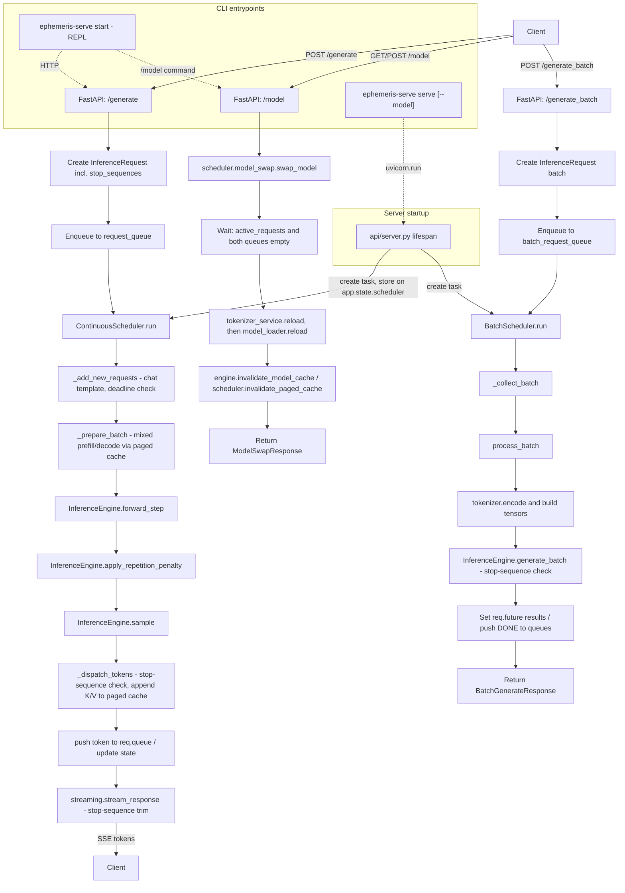

# Architecture

## Architecture Flow

> The scheduler batches active requests and reuses each request's slice of a shared paged KV cache to avoid recomputing full prompts on every step -- including when a brand-new (prefill) request joins the same batched step as requests already mid-decode.

---

## Root Entry Point

### `main.py`

The launcher used during local development and by `make run`/`make run-prod`.

Implementation details:
- Imports `uvicorn` and `app` from `api.server`.
- Calls `uvicorn.run("main:app", host="0.0.0.0", port=8000, workers=1, reload=True)`.
- `workers=1` is explicitly chosen for development and to avoid model loading overhead on multiple workers.
- `reload=True` enables auto-reload on source changes and should be disabled in production.

### `ephemeris-serve serve` (`cli/main.py`)

An alternative entrypoint to `main.py`, installed via the `[project.scripts]` entry point. Runs the same `api.server:app`, but exposes `--host`, `--port`, `--workers`, `--reload`, and (unlike `main.py`) `--model` as CLI flags instead of hardcoded values. See [CLI Layer](CLI-and-Configuration#cli-layer) below.

---

## Internal Control Flow Summary

1. `api/routes.py` receives a validated request (checking `swap_lock` first) and creates `InferenceRequest`.
2. The request is enqueued into `request_queue`.
3. `ContinuousScheduler.run()` wakes up and calls `_add_new_requests()`, which applies the chat template and tokenizes.
4. `_prepare_batch()` builds one batched step's inputs, mixing any brand-new (prefill) requests with any already mid-decode, using the paged KV cache's `gather_dense()` for the past.
5. `InferenceEngine.forward_step()` executes the model and returns logits and the new `past_key_values`.
6. `apply_repetition_penalty()` modifies logits to reduce repetitions.
7. `InferenceEngine.sample()` selects a next token for each active request.
8. `_dispatch_tokens()` streams the token to the client's queue, checks it against any configured `stop` sequences, appends the newly computed K/V into the paged cache, and finishes requests that hit a stop sequence, EOS, or `max_tokens`.
9. `stream_response()` decodes accumulated tokens, independently re-checks `stop` sequences, and yields buffered text fragments as SSE frames.
10. The scheduler repeats until all active requests finish.

(A `POST /api/model` swap instead routes through `scheduler/model_swap.py`: drain `active_requests`/both queues, reload tokenizer then model, invalidate the engine's cached model reference and the scheduler's paged cache.)

---

## Request Lifecycle Summary

1. Client sends `POST /api/generate` with a prompt and optional `max_tokens`/`temperature`/`stop`/`idempotency_key`.
2. `api/routes.py` builds `InferenceRequest` and enqueues it onto `request_queue` (after checking `swap_lock` and any idempotency replay).
3. `ContinuousScheduler` asynchronously pulls queued requests, applies the chat template, and tokenizes.
4. Each step, the scheduler forms a batch mixing any new prefills with any requests already mid-decode, gathering each row's cached past from the shared `PagedKVCache`.
5. `InferenceEngine` computes logits, applies repetition penalty, and samples next tokens.
6. The scheduler dispatches each token to its request's streaming queue, checks it against `stop` sequences, and appends new K/V into the paged cache.
7. `stream_manager` decodes accumulated tokens, buffers to natural boundaries, independently enforces `stop` sequences, and emits fragments through SSE.
8. When a stop sequence matches, EOS is reached, or `max_tokens` is hit, the request completes and a `"[DONE]"` sentinel closes the stream (or a single `error` frame does, on failure/timeout).
